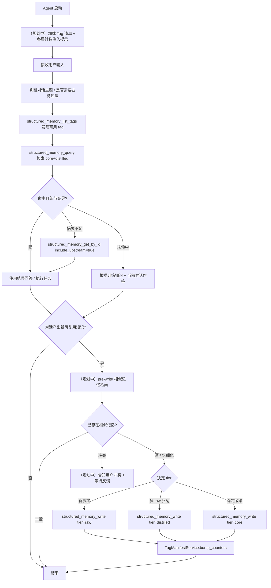

# Structured Memory 使用说明

> 面向使用者（agent prompt 设计者、skill 编写者、调用方）的功能与流程说明。
> 开发指南（未来增量、模块拆分、内部接口）见 [STRUCTURED_MEMORY_DEVELOPMENT.md](STRUCTURED_MEMORY_DEVELOPMENT.md)。

## 1. 这是什么

Structured Memory 是 DeerFlow 在会话记忆（`memory.json`）之外，提供给 agent 的**跨会话业务知识库**：

- 用于沉淀**库表结构、ETL 规则、约束、排障经验、命名规范**等可复用知识。
- 与会话记忆**完全解耦**：会话记忆走 `MemoryMiddleware` 自动异步提炼；Structured Memory **只在 agent 显式调用工具时**才写入。
- 存储后端为 **ChromaDB（持久化）**，数据目录与 `memory.json` 平级（`{memory_dir}/chromadb/`）。

> 当前阶段刻意**不引入用户审批确认环节**：是否写入、写入哪一层、写什么内容均由 agent 在系统 Prompt 与 Skill 约束下自主决定，再通过工具显式落库。

## 2. 三层记忆模型

| 层 | 含义 | 来源 | 必填字段 |
|---|---|---|---|
| **raw** | 单次会话中沉淀的原始证据 | 当前对话线程内的用户陈述、SQL、报错、路径、链接 | `source_thread_id`（会话 id） |
| **distilled** | 多条 raw 的归纳/合并 | 同主题 raw 的提炼 | `raw_memory_ids`（≥ 1） |
| **core** | 稳定可复用的抽象/规则 | 多条 distilled 的进一步抽象 | `distilled_memory_ids`（≥ 1） |

记录共性字段：`id`、`title`、`content`、`tags`、`created_at`、`updated_at`、`source_agent`、`user`。

ID 命名规则（用于路由到对应 collection / 校验 tier）：
- `raw_<uuid>` → `memory_raw` collection
- `distilled_<uuid>` → `memory_distilled` collection
- `core_<uuid>` → `memory_core` collection

血缘只通过 ID 列表关联（distilled → raw、core → distilled），不冗余原文。

## 3. 数据契约

定义在 `backend/packages/harness/deerflow/memory/models.py`：

```36:60:backend/packages/harness/deerflow/memory/models.py
class RawMemoryRecord(MemoryRecordCommon):
    """Raw memory derived from a single conversation thread.

    The agent may fold user uploads (files, images) and inline URLs from that
    dialogue into one or more raw rows; provenance stays anchored on
    ``source_thread_id`` with optional path/URL lists for attachments cited
    in the organized content.
    """

    source_thread_id: str = Field(..., min_length=1)
    attachment_file_paths: list[str] = Field(default_factory=list)
    attachment_image_paths: list[str] = Field(default_factory=list)
    inline_web_urls: list[str] = Field(default_factory=list)


class DistilledMemoryRecord(MemoryRecordCommon):
    """Distilled memory produced from one or more raw rows."""

    raw_memory_ids: list[str] = Field(..., min_length=1)


class CoreMemoryRecord(MemoryRecordCommon):
    """Core memory synthesized from one or more distilled rows."""

    distilled_memory_ids: list[str] = Field(..., min_length=1)
```

## 4. 配置开关

`config.yaml` 中的 `structured_memory` 段（示例见 `config.example.yaml`）：

```yaml
structured_memory:
  enabled: true              # 总开关；关闭后写/读工具不会注入到 agent
  store: chroma              # 仅支持 chroma；预留扩展
  write:
    max_content_length: 100000   # 单条 content 字符上限
  query:
    default_top_k: 5             # 未传 top_k 时返回数
    max_top_k: 20                # 单次查询硬上限
    default_tiers:               # 未传 tier_filter 时检索的层
      - core
      - distilled
```

校验路径：
- 开关在 `deerflow/config/structured_memory_config.py`；`enabled=false` 时 `get_structured_memory_repository()` 抛 `StructuredMemoryDisabledError`。
- 工具仅在 `enabled=true` 时注入，见 `deerflow/tools/tools.py`。

## 5. Agent 可用工具

启用后，以下 6 个 builtin 工具会自动加入 lead agent 工具集，并在系统 Prompt 中插入 `<structured_memory_system>` 段（见 `lead_agent/prompt.py::_build_structured_memory_section`）。

| 工具 | 作用 | 关键参数 |
|---|---|---|
| `structured_memory_write` | 写入一条记录到指定 tier | `tier`、`title`、`content`、`tags`；raw 需 `source_thread_id`；distilled 需 `raw_memory_ids`；core 需 `distilled_memory_ids` |
| `structured_memory_update` | 更新一条记录的 `title/content/tags`（保留血缘字段） | `memory_id`、`title`、`content` |
| `structured_memory_delete` | 按 id 删除 | `memory_id`；若被下游引用会拒绝 |
| `structured_memory_query` | 跨层语义检索 | `query_text`、`tier_filter`、`tags`、`top_k` |
| `structured_memory_list_tags` | 列出现有 tag 与每层计数 | `tier_filter` |
| `structured_memory_get_by_id` | 精确按 id 取记录，可同时展开上游血缘 | `memory_id`、`include_upstream` |

工具签名见 `backend/packages/harness/deerflow/tools/builtins/structured_memory_*_tool.py`。

## 6. 推荐使用流程

下面是当前**已实现**能力下推荐的 agent 行为；标 *(规划中)* 的步骤会在后续版本由系统自动执行（见开发文档第 3 节）。



### 6.1 读路径（每次需要业务知识时）

1. `structured_memory_list_tags` 看可用分类（避免盲查）。
2. `structured_memory_query(query_text=..., tags=..., tier_filter=["core","distilled"])`。
3. 命中过粗时 `structured_memory_get_by_id(id, include_upstream=true)` 沿 core → distilled → raw 回溯证据。

### 6.2 写路径（仅在产生稳定可复用知识时）

- **raw**：将本次对话中可独立复用的事实/SQL/报错/约束写一条；必填 `source_thread_id`（工具会自动从 runtime 拿当前 LangGraph thread id，跨会话需显式传）。
- **distilled**：发现已有多条相同主题的 raw 时归纳为一条，引用其 ids。
- **core**：经过验证的稳定政策/规范，引用支撑的 distilled ids。

> **不要写入**：寒暄、临时计算结果、与业务无关的对话片段、易变的运行状态。

### 6.3 更新与删除

- 同一主题的事实变化 → `structured_memory_update`（保留 id 与血缘）。
- 弃用记录 → `structured_memory_delete`，**按 core → distilled → raw** 顺序删，否则被下游引用时会拒绝。

## 7. Tag 命名约定（保持检索可用）

prompt 中已约束如下命名维度（建议每条 3–8 个标签）：

- **领域**：`dw`、`etl`、`catalog`、`lineage`、`sql`、`ops`
- **资产/对象**：`table:fact_orders`、`pipeline:nightly_ingest`、`dataset:sales`
- **知识类型**：`schema`、`constraint`、`sla`、`troubleshooting`、`convention`、`breaking-change`
- **环境（可选）**：`prod`、`staging`（仅当显著影响事实）

避免一次性标签（如 `user-question`、`todo`）。

## 8. 与会话记忆的差异

| 维度 | 会话记忆 (`memory.json`) | Structured Memory |
|---|---|---|
| 触发 | `MemoryMiddleware` 异步自动 | Agent 显式调用工具 |
| 存储 | JSON 文件，整体读写 | Chroma 向量库，按记录 CRUD |
| 内容 | 用户上下文 + 偏好 + 历史 + 离散事实 | 业务知识（库表/规则/排障/规范） |
| 注入 | 系统提示 `<memory>` 段 | 系统提示 `<structured_memory_system>` 工具说明（不直接注入数据） |
| 跨会话 | 是 | 是，且更结构化、可血缘追溯 |

## 9. 数据位置

- 默认目录：`backend/.deer-flow/memory/chromadb/`（与 `memory.json` 同级）。
- 可通过 `memory.storage_path` 间接改变（structured memory 取其父目录）。
- 四个 collection：
  - `memory_raw` / `memory_distilled` / `memory_core` — 三层记忆正文
  - `memory_tag_manifest` — 每个 tag 的跨层计数快照（`counts_json` 存 `{tier: count}`，并预留 `definition`、`scope_keywords_json` 用于后续 `TagDefinitionService`）。manifest 由 `StructuredMemoryRepository` 与 `TagManifestService` 协同维护：写入/更新/删除会 write-through 到该 collection，服务层再叠一层 TTL 读缓存。

## 10. 常见错误与排查

| 现象 | 原因 / 处理 |
|---|---|
| `structured_memory_write failed: tier raw requires a non-empty source_thread_id` | 跨会话写入未显式提供线程 id；当前对话写入时通常由 runtime 自动注入，若仍报错检查中间件是否裁剪掉 thread_id |
| `content exceeds structured_memory.write.max_content_length` | 单条超长，需拆分或汇总后再写 |
| `raw_memory_ids reference unknown raw record(s)` | 写 distilled 时引用了不存在的 raw id；先确认 raw 已写入 |
| `Cannot delete raw memory that is referenced by distilled memory` | 删序错误；先删下游 distilled / core，或更新其 lineage |
| `Structured memory is disabled` | `structured_memory.enabled=false`，或工具被禁用 |
| 查询命中 0 结果 | tier 默认仅 core+distilled；若只写过 raw，需显式 `tier_filter=["raw"]`；或先 `list_tags` 确认 tag 拼写 |

## 11. 单测入口

| 文件 | 覆盖范围 |
|---|---|
| `backend/tests/test_structured_memory_config.py` | 配置加载、开关语义 |
| `backend/tests/test_structured_memory_write.py` | Write 服务/工具的成功与失败路径 |
| `backend/tests/test_structured_memory_search.py` | Query / list_tags / get_by_id |
| `backend/tests/test_structured_memory_mutation.py` | Update / Delete + 下游引用拒绝 |

运行：

```bash
cd backend && uv run pytest tests/test_structured_memory_*.py -v
```
