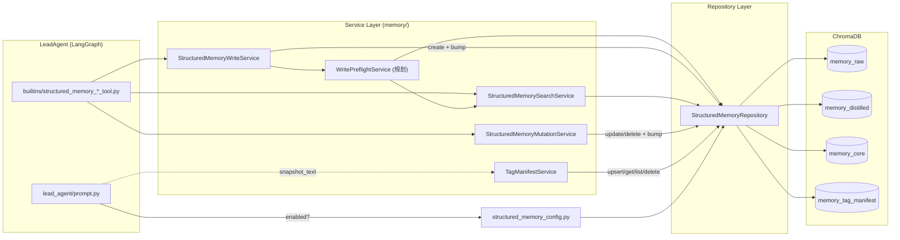
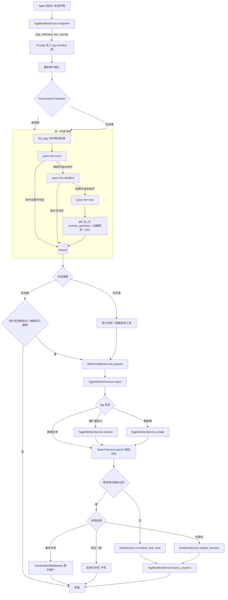

# Structured Memory 开发指南

> 面向后续开发者：解释当前模块结构，并把目标流程图落到**可实现的代码增量**上。
> 使用说明（功能与调用流程）见 [STRUCTURED_MEMORY.md](STRUCTURED_MEMORY.md)。
> MVP 演进背景见 `docs/plans/2026-04-10-structured-memory-mvp-plan.md`。

---

## 1. 现状代码地图

```
backend/packages/harness/deerflow/
├── config/
│   └── structured_memory_config.py      # 开关 + 写/查/manifest 护栏配置（Pydantic）
└── memory/
    ├── __init__.py                      # 对外导出
    ├── models.py                        # MemoryTier + Raw/Distilled/Core + TagManifestRecord
    ├── repository.py                    # Chroma 4 个 collection：raw/distilled/core + tag_manifest
    ├── structured_memory_write_service.py     # 校验 + 规范化 + 写入分发（成功后 bump manifest）
    ├── structured_memory_search_service.py    # search / list_tags / get_by_id + 格式化
    ├── structured_memory_mutation_service.py  # update / delete + 下游引用保护 + manifest 差量
    └── tag_manifest_service.py                 # TTL 读缓存 + write-through 持久化 + rebuild_from_tiers
backend/packages/harness/deerflow/tools/builtins/
├── structured_memory_write_tool.py          # @tool wrapper, runtime thread_id 自动注入
├── structured_memory_update_tool.py
├── structured_memory_delete_tool.py
├── structured_memory_query_tool.py
├── structured_memory_list_tags_tool.py
└── structured_memory_get_by_id_tool.py
backend/packages/harness/deerflow/agents/lead_agent/
└── prompt.py                                 # _build_structured_memory_section 注入 <structured_memory_system>
backend/tests/
├── test_structured_memory_config.py
├── test_structured_memory_write.py
├── test_structured_memory_search.py
└── test_structured_memory_mutation.py
```

### 1.1 已实现能力（基线）

| 能力 | 关键模块 | 备注 |
|---|---|---|
| 配置开关 + 单例 | `structured_memory_config.py`、`repository.get_structured_memory_repository` | `enabled=false` 抛 `StructuredMemoryDisabledError` |
| Chroma 持久化 | `StructuredMemoryRepository` | 四 collection：`memory_raw/distilled/core` + `memory_tag_manifest` |
| 显式写入 | `StructuredMemoryWriteService.normalize_and_write` + `structured_memory_write` 工具 | 校验长度、tier 字段；血缘前置存在性校验；成功后 bump tag manifest |
| 检索 | `StructuredMemorySearchService.search` + `structured_memory_query` | 默认 `core+distilled`；tag 过滤为召回后过滤 |
| 标签发现 | `list_tags` + `structured_memory_list_tags` | 按 tier 维度计数（基于全表扫描） |
| 血缘回溯 | `get_by_id(include_upstream=True)` | core → distilled → raw 最深 2 层 |
| 编辑 / 删除 | `StructuredMemoryMutationService` + 对应工具 | 删除时强制下游优先；完成后推送 manifest 差量 |
| **Tag Manifest 持久化 + 计数缓存** | `TagManifestService` + `StructuredMemoryRepository.upsert_tag_manifest / get / list / delete` | Write-through 到 `memory_tag_manifest`；服务层 TTL 读缓存；首次运行自动从三层记忆 bootstrap；`rebuild_from_tiers()` 做显式漂移修复 |
| Prompt 接入 | `lead_agent/prompt.py::_build_structured_memory_section` | 仅在 `enabled=true` 时注入说明；`tag_manifest.inject_in_prompt` 开关 manifest 段落 |

### 1.2 当前缺口（与目标流程图对照）

| 目标流程节点 | 当前状态 |
|---|---|
| Agent 启动**同步 Tag 清单 + 各层计数**注入 prompt | ✅ 已实现：`TagManifestService.snapshot_text` 接入 `_build_structured_memory_section`；Chroma 持久化 + TTL 读缓存 |
| 对话类型判定（咨询/任务） | ❌ 未实现，统一交给 agent prompt 自由决定 |
| **统一检索逻辑**（Core → Distilled → Raw 级联 + 附件回放） | ⚠️ 检索本身有，但级联与附件展开未自动化，靠 agent 多次工具调用 |
| Tag 治理（Tag 是否可直接使用 / 扩展定义域 / 新建） | ⚠️ manifest 已预留 `definition` / `scope_keywords`；`TagDefinitionService` 逻辑仍待实现 |
| 写前**相似记忆检索 + 冲突检测** | ❌ 未实现，需新增 `WritePreflightService` |
| 一致 → 反馈无需新增 / 冲突 → 等待用户反馈 | ❌ 一致路径未实现；冲突需配合澄清流（暂缓的 MVP-2） |
| 各 Tag 各 tier 记忆**计数缓存与刷新** | ✅ 已实现：`bump_counters` write-through + `rebuild_from_tiers` 漂移修复 |

后续开发任务围绕这些缺口展开。

---

## 2. 模块分层与依赖关系



依赖纪律：

- **Tools 永远不直接调用 Repository**；统一走 service。
- **Service 之间允许组合**（如 `WritePreflightService` 内部调 `SearchService`）。
- **Service 不直接读 `ToolRuntime` 或 `langgraph` 配置**；上下文（thread_id 等）由 tool wrapper 注入。
- **Harness 不允许 import `app.*`**（CI 强制，见 `tests/test_harness_boundary.py`）。

---

## 3. 目标完整流程（落地版）

把用户提供的抽象流程图，按现有模块 + 规划模块绘成可实施版本：



下面按步骤把每个节点对应到代码增量。

### 3.1 启动同步 Tag 清单（`TagManifestService` — **已落地**）

**目标**：每次 agent 构建 prompt 时拿到 `{tag → tier_counts}` 的快照，注入到 `<structured_memory_system>` 中，让模型在检索/写入前就知道"现有分类长什么样、各层多少条"。

**模块位置**：`backend/packages/harness/deerflow/memory/tag_manifest_service.py` + `StructuredMemoryRepository.*_tag_manifest` 方法。

**数据契约**：`TagManifestRecord`（见 `memory/models.py`）

```python
class TagManifestRecord(BaseModel):
    tag: str
    counts_by_tier: dict[str, int]   # {"raw": 3, "distilled": 1}
    total: int
    created_at: str
    updated_at: str
    definition: str = ""             # 预留：TagDefinitionService 后续填充
    scope_keywords: list[str] = []   # 预留
```

**服务 API**（精简）：

```python
class TagManifestService:
    def snapshot(self, *, tier_filter=None) -> list[TagManifestEntry]: ...
    def bump_counters(self, *, tags, tier, delta) -> None: ...   # write-through
    def invalidate(self) -> None: ...                            # 清 TTL 缓存
    def rebuild_from_tiers(self) -> None: ...                    # 显式漂移修复
    def snapshot_text(self, *, max_tags=None) -> str: ...        # prompt 段渲染
```

**实现要点**：

- **持久化**：`StructuredMemoryRepository` 新增 `memory_tag_manifest` collection，每条记录 id 为 tag 字符串，metadata 包括 `counts_json`、`total`、`created_at/updated_at`、`definition`、`scope_keywords_json`。所有 CRUD 走 `repo.upsert_tag_manifest / get_tag_manifest / list_tag_manifest / delete_tag_manifest`。
- **Write-through**：`bump_counters` 永远先读当前 tag 记录 → 叠加 delta → upsert 回 Chroma（所有 tier 计数降到 0 时删除记录），再同步更新内存缓存。这样即使没跑过 `snapshot()`，写入也能被后续 agent 会话看到。
- **TTL 读缓存**：`snapshot()` 检查缓存是否过期（`structured_memory.tag_manifest.cache_ttl_seconds`，默认 60s，0 = 禁用）；过期则从 `repo.list_tag_manifest()` 一次性读回所有 tag。
- **首次 bootstrap**：如果 `list_tag_manifest()` 返回空，但三层 collection 里有 tag 数据（老库升级场景），`_reload_cache` 会 full-scan 三层 → 批量 upsert 到 manifest → 再返回。首次运行后续读都走 manifest collection，不再扫 tier。
- **Prompt 接入**：`_build_structured_memory_section` 末尾调用 `_build_structured_memory_tag_manifest_section(sm_config)`，后者调 `snapshot_text()`。受 `structured_memory.tag_manifest.inject_in_prompt` 控制；任何异常只记 log，不阻塞主 guidance。
- **漂移修复**：手工编辑、测试绕过 service 直接 `repo.create_*` 等会导致 manifest 与 tier 不一致时，调 `rebuild_from_tiers()` → 重扫 + upsert 所有活 tag + 删除已不存在的 tag + `invalidate()`。

**相关配置**（`structured_memory.tag_manifest`）：`inject_in_prompt`（默认 `true`）、`cache_ttl_seconds`（默认 60）、`max_tags_in_prompt`（默认 80）。

### 3.2 对话类型判定（可选，建议**不强行实现**）

流程图中区分"咨询类/任务类"。结合现有架构：

- 当前 lead agent 已用统一 react loop 处理两类对话；引入硬分类会与 plan mode、subagent 分支耦合。
- **建议**：以**软提示**形式让 agent 自行判断（在 prompt 中加 `先判断本轮是「问答/咨询」还是「执行任务」，再决定是否触发写入路径`），而**不增加新的中间件状态字段**。
- 真正需要硬分类时，再新增 `ConversationIntentMiddleware`（参考 `ClarificationMiddleware` 结构），输出 `state.conversation_intent: Literal["consult","task"]`。

### 3.3 统一检索 Pipeline（新增 `StructuredMemoryRetrievalPipeline`）

目标：让 agent 一次工具调用即可拿到"Core 优先、按需逐层下钻、自动展开附件"的结果，减少 prompt 中"先 list_tags 再 query 再 get_by_id"的三跳依赖。

**新增模块**：`backend/packages/harness/deerflow/memory/structured_memory_retrieval_pipeline.py`

```python
@dataclass(frozen=True)
class CascadeQueryResult:
    hits: list[SearchResultItem]
    expanded_lineage: list[MemoryWithLineage]
    attachment_refs: list[str]   # 触发的附件路径 / URL（不直接读文件，由 caller 决定）
    matched_tier: MemoryTier | None  # 最终回答主要落在哪一层

class StructuredMemoryRetrievalPipeline:
    def __init__(self, search: StructuredMemorySearchService): ...
    def cascade_query(
        self,
        *,
        query_text: str,
        tags: list[str] | None = None,
        max_per_tier: int = 3,
        require_detail_chars: int = 200,    # core 命中但 content < threshold 时下钻
    ) -> CascadeQueryResult: ...
```

**算法**：

1. `core` → 命中且任一 hit `len(content) >= require_detail_chars`：直接返回。
2. 否则下钻 `distilled`，命中且充足：返回 `core_hits + distilled_hits`。
3. 仍不足，下钻 `raw`，并对最相关 raw 调用 `get_by_id(include_upstream=False)` 取出附件字段（`attachment_file_paths/attachment_image_paths/inline_web_urls`）。
4. 命中纯空时返回空 `CascadeQueryResult`。

**新增工具**：`structured_memory_recall`（调度上述 pipeline）。**保留** `query/list_tags/get_by_id` 作为细粒度工具，避免 breaking change。

### 3.4 Tag 定义管理（新增 `TagDefinitionService`）

当前 tag 只是字符串列表，没有"含义/定义域"。要实现流程图的"Tag 可直接使用 / 扩展定义域 / 新增"判定，需要持久化标签语义。

**存储方案**：

- 新增 Chroma collection `memory_tag_definitions`，每条 metadata：`{tag, definition, scope_keywords_json, created_at, updated_at, related_tags_json}`。
- 或更简：单独 SQLite 表（与 dw-catalog 同款）。**推荐 Chroma 单 collection**，避免引入新 store 类型。

**新增模块**：`backend/packages/harness/deerflow/memory/tag_definition_service.py`

```python
class TagDefinitionService:
    def get(self, tag: str) -> TagDefinition | None: ...
    def upsert(self, *, tag: str, definition: str, scope_keywords: list[str]) -> TagDefinition: ...
    def match(self, *, candidate_tag: str, content: str) -> TagMatchDecision: ...
    # TagMatchDecision = Literal["reuse", "extend", "create"]
```

**新增工具**：

- `structured_memory_define_tag(tag, definition, scope_keywords?)`：让 agent 显式建立或扩展。
- 写入路径在 `WritePreflightService` 内自动调用 `match`，需要扩展时返回结构化提示而不是直接写。

### 3.5 写前 Preflight（新增 `WritePreflightService`）

把流程图中"匹配 Tag → 检索相似 → 冲突检测/一致检测"封装为一次服务调用，降低 agent prompt 复杂度。

**新增模块**：`backend/packages/harness/deerflow/memory/structured_memory_write_preflight_service.py`

```python
class PreflightDecision(StrEnum):
    PROCEED_WRITE = "proceed_write"            # 全新内容，直接写
    PROCEED_UPDATE = "proceed_update"          # 已有相似记忆，建议 update
    SKIP_DUPLICATE = "skip_duplicate"          # 完全一致
    BLOCK_CONFLICT = "block_conflict"          # 事实冲突，需用户介入

@dataclass(frozen=True)
class PreflightResult:
    decision: PreflightDecision
    similar: list[SearchResultItem]
    conflict_summary: str | None
    suggested_update_id: str | None
    tag_actions: list[TagAction]   # reuse / extend / create

class WritePreflightService:
    def prepare(
        self,
        *,
        tier: MemoryTier,
        title: str,
        content: str,
        tags: list[str],
        ...,
    ) -> PreflightResult: ...
```

**冲突检测策略（首版）**：

- 召回 top_k 相似记忆（`tier=同 tier`，`top_k=5`）。
- **完全一致**：normalize（trim + 折叠空白）后 `content` 与 `tags` 集合相同。
- **事实冲突**：内容相似度高（distance < `conflict_distance_threshold`，默认 0.2）但**关键陈述差异显著**。首版可用启发式：
  - 命中存在数字/日期/枚举字面量与新内容不同 → 标记冲突。
  - LLM-as-judge 留待 MVP-4 启用。
- **细化**：相似但新内容长度显著大于原记录或新增段落 → 建议 `update`。

**Tool 集成**：

- `structured_memory_write` 默认走 preflight；新增 `force=True` 参数允许跳过（用于显式 override）。
- 冲突时返回结构化错误，prompt 引导 agent 调用 `ask_clarification`（沿用既有 `ClarificationMiddleware`）。

### 3.6 一致 / 冲突反馈接入既有澄清流

- **一致**：`structured_memory_write` 直接返回 `Skipped (duplicate of <id>)`，agent 不再调用工具。
- **冲突**：preflight 返回 `BLOCK_CONFLICT` + `conflict_summary`。Agent 在系统 prompt 引导下调用 `ask_clarification(question=..., options=["保留旧值","用新值覆盖","合并"])`。
- **澄清完成后**：用户选择走 `structured_memory_update` 或 `structured_memory_write(force=True)`。

> 这一段与 MVP plan 中"暂缓的 MVP-2 确认闭环"自然衔接：本节落地后即等价于轻量版 MVP-2，**不需要**新增 `StructuredMemoryConfirmationMiddleware`，复用 `ClarificationMiddleware` 即可。

### 3.7 计数刷新（已落地）

- `WriteService.normalize_and_write` 成功 → `TagManifestService.bump_counters(tags, tier, +1)`（write-through 到 `memory_tag_manifest`）。
- `MutationService.delete_memory` 成功 → `bump_counters(tags, tier, -1)`；任一 tier 全部降到 0 时 manifest 记录被删除。
- `MutationService.update_memory` 成功且 tags 变化 → update 前先 `_fetch_tags` 拿老 tags，旧 tags `-1`、新 tags `+1`（同一 tier）。
- bump 在 service 层用 try/except 包裹，manifest 维护失败**不会**阻塞主写入流程；真正的 drift 依赖 `rebuild_from_tiers()` 修复。

---

## 4. 配置扩展规划

`structured_memory_config.py` 需要新增以下字段（按阶段渐进，**不要**一次性堆上）：

```yaml
structured_memory:
  enabled: true
  store: chroma
  write:
    max_content_length: 100000
    preflight:
      enabled: true
      similar_top_k: 5
      conflict_distance_threshold: 0.2
      enable_llm_judge: false        # MVP-4 才打开
  query:
    default_top_k: 5
    max_top_k: 20
    default_tiers: [core, distilled]
    cascade:
      enabled: true
      require_detail_chars: 200
  tag_manifest:
    inject_in_prompt: true
    cache_ttl_seconds: 60
    max_tags_in_prompt: 80
  tag_definitions:
    enabled: false                   # 与 TagDefinitionService 同步开
```

每新增一组字段都要：

1. 同步更新 `config.example.yaml` 并 bump `config_version`。
2. 在 `Pydantic` 模型中加默认值，确保旧配置依然可用。
3. 增加单测覆盖默认值与边界值。

---

## 5. 测试规划

新增模块都必须遵循现有 TDD 约定（`backend/CLAUDE.md` §Development Workflow）。建议新增：

| 测试文件 | 覆盖 |
|---|---|
| `test_structured_memory_tag_manifest.py` | snapshot 缓存命中/失效、计数加减、空库 |
| `test_structured_memory_retrieval_pipeline.py` | core 命中即返回 / 下钻 distilled / 下钻 raw + 附件展开 / 全空 |
| `test_structured_memory_tag_definition.py` | upsert / match 三种 decision / 冲突 tag scope |
| `test_structured_memory_write_preflight.py` | 4 种 PreflightDecision + force 跳过 + tag_actions |
| `test_structured_memory_recall_tool.py` | tool wrapper 透传参数 + 异常文案 |

集成层补充：

- `test_lead_agent_prompt.py`：断言 `<structured_memory_system>` 中包含 tag manifest 段（开启时）。
- 现有 `test_structured_memory_write.py` 要新增 preflight enabled 时的 fallback 测试。

---

## 6. 实施顺序建议

按"短链路、可独立验收"原则推进：

1. ✅ **TagManifestService（持久化 + 计数）+ Prompt 注入**：已落地；Chroma `memory_tag_manifest` 收敛计数，TTL 缓存 + write-through 持久化 + `rebuild_from_tiers` 漂移修复。
2. **RetrievalPipeline + `structured_memory_recall` 工具**：从"agent 多次工具调用"收敛为"一次级联检索"。
3. **WritePreflightService（一致 + 相似检测）**：先不做事实冲突判定，仅返回 `SKIP_DUPLICATE / PROCEED_UPDATE / PROCEED_WRITE`。
4. **接入 `ask_clarification`**：在 preflight 中加冲突分支，复用既有澄清流。
5. **TagDefinitionService**：复用 manifest 已预留的 `definition` / `scope_keywords` 字段扩展，不再需要新 collection。
6. **LLM-as-judge / 治理（MVP-4）**：观测一段时间后再决定。

每一步完成后必须通过质量门禁：

```bash
cd backend && uv run pytest tests/ -v
cd backend && uvx ruff check .
```

---

## 7. 与既有架构的对齐要点

- **中间件**：本规划不新增 lead-agent 中间件；`ClarificationMiddleware` 已能承载冲突阻断。后续若引入 `ConversationIntentMiddleware`，须在 `_build_middlewares` 中按既有顺序追加（参考 `backend/CLAUDE.md §Middleware Chain`）。
- **Skill 集成**：相关 Skill（如 `datawarehouse-processor`）可在 SKILL.md 中显式引用 `structured_memory_recall` 与 `structured_memory_write`，让流程更确定。
- **Memory 隔离**：`MemoryStorage`（会话记忆）保持原状；`StructuredMemoryRepository` 不复用其接口，避免"整体读写"语义污染（详见 plan 文档 §2.2）。
- **Upstream 合并**：本规划新增文件均位于 `deerflow/memory/` 与 `tools/builtins/`，与 upstream 主干热点冲突概率低。Prompt 段需在合并 upstream `lead_agent/prompt.py` 时优先保留 `<structured_memory_system>` 块，再确认 tag manifest 注入点未被覆盖。

---

## 8. 与流程图的字段对应表

| 用户流程图节点 | 落地代码 / 模块 | 状态 |
|---|---|---|
| 加载并同步 Tag 清单 | `TagManifestService.snapshot` + `repo.list_tag_manifest` | ✅ 已落地 |
| 传递 Tag 名称、含义、各 Tier 计数 | `TagManifestService.snapshot_text` → prompt | ✅ 已落地（含义/定义字段预留） |
| 判断对话类型 | Agent prompt 软判定（默认）；`ConversationIntentMiddleware`（可选） | 软判定即可 |
| 优先检索 Core | `RetrievalPipeline.cascade_query` step 1 | 规划 |
| Core 不足检索 Distilled | step 2 | 规划 |
| Distilled 不足检索 Raw + 附件 | step 3 + `attachment_*` 字段 | 规划 |
| 完成用户任务 | 既有 lead agent loop | 已有 |
| 用户反馈新记忆 | Agent 在 prompt 引导下识别 | 已有（prompt） |
| 匹配现有 Tag 定义 | `TagDefinitionService.match`（基于 manifest `definition`/`scope_keywords`） | 规划 |
| 扩展 Tag 定义域 | `repo.upsert_tag_manifest(definition=..., scope_keywords=...)` | 规划（schema 已就绪） |
| 创建新 Tag | 同上 | 规划 |
| 检索现有相似记忆 | `WritePreflightService.prepare` 内部调 search | 规划 |
| 事实冲突 → 等用户反馈 | preflight 返回 BLOCK + `ask_clarification` | 规划 |
| 一致 → 反馈已有 | preflight 返回 SKIP_DUPLICATE | 规划 |
| 写入 / 更新 | `WriteService` / `MutationService` | 已有（含 manifest bump） |
| 更新 Tag 各 tier 计数 | `TagManifestService.bump_counters` write-through | ✅ 已落地 |

---

## 9. 风险与回滚策略

| 风险 | 缓解 |
|---|---|
| Pipeline 自动级联导致 token 暴涨 | `cascade.require_detail_chars` 与 `top_k` 双控；提供配置关闭单跳 |
| Preflight 误判一致而吞掉合法新事实 | 默认仅做严格一致比较；冲突判定先不开 LLM-judge；保留 `force=True` |
| Tag 定义滥扩 | `TagDefinitionService.upsert` 强制传 `scope_keywords` 与 `definition`，避免空定义；定期 review |
| Chroma 单 collection 写入瓶颈 | 仍保持 raw/distilled/core 三 collection；tag_definitions 独立 collection |
| Prompt 注入失败 | 所有规划模块都要在 `enabled=false` 或异常时静默 fallback，不阻塞 agent 启动 |

---

## 10. 参考与延伸阅读

- 当前实现源码：`backend/packages/harness/deerflow/memory/`、`tools/builtins/structured_memory_*_tool.py`、`agents/lead_agent/prompt.py`。
- MVP 规划与历史决策：`docs/plans/2026-04-10-structured-memory-mvp-plan.md`。
- 会话记忆机制（对照参考）：`backend/docs/MEMORY_IMPROVEMENTS.md`。
- 中间件装配顺序：`backend/CLAUDE.md` §Middleware Chain。
- 二开协作纪律：`.cursor/rules/development-core-guidance.mdc`。
