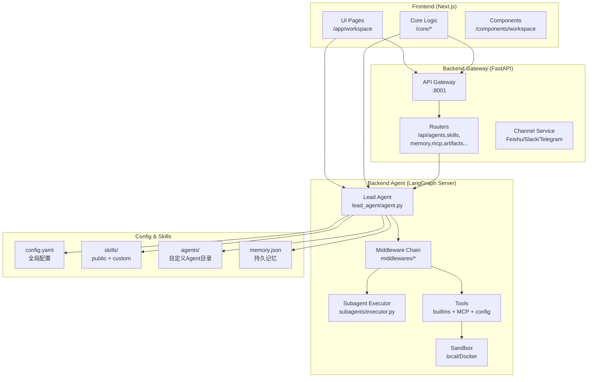
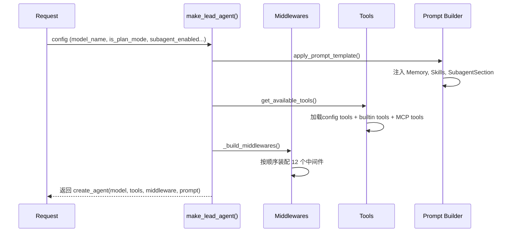
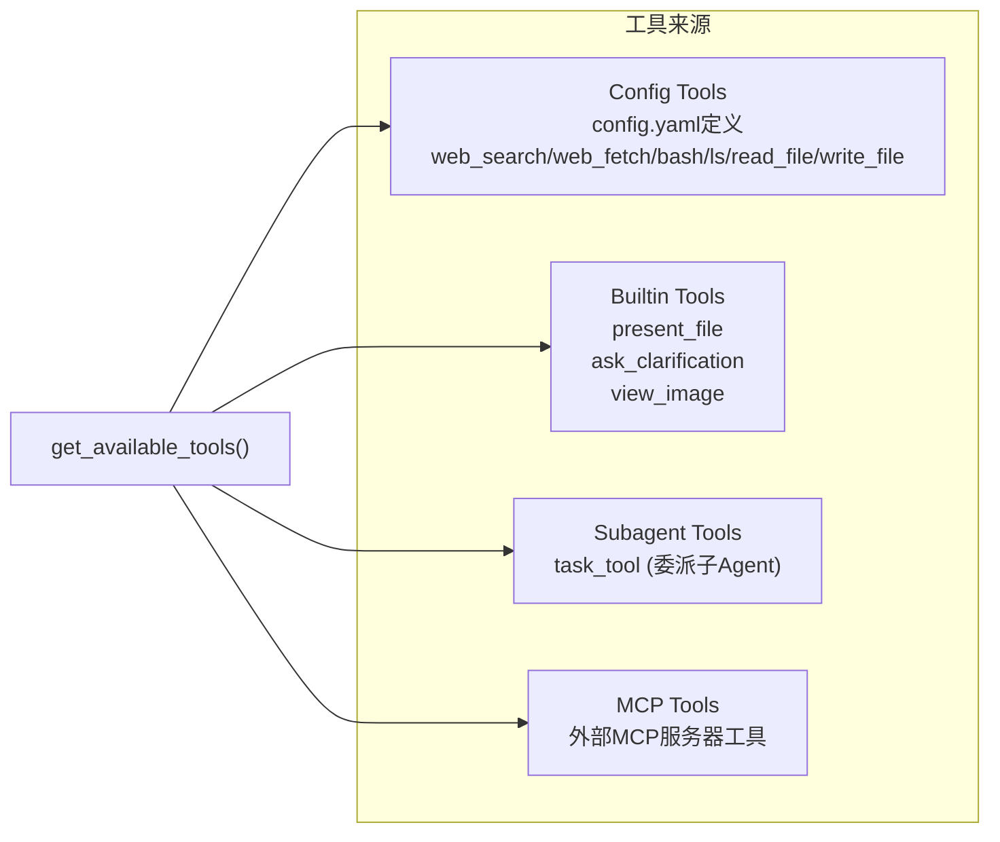

# DeerFlow 架构说明

> 项目架构说明（节选自原 `overview.md`）。配套文档：`docs/architecture-code-examples.md`、`docs/feature-development-suggestions.md`。

## 一、整体架构概览

DeerFlow 采用前后端分离 + LangGraph 智能体服务器的三层架构：



---

## 二、后端详细架构

### 2.1 目录结构总览

```
backend/
├── app/                          # 应用层（可部署服务）
│   ├── gateway/                  # FastAPI Gateway 服务
│   │   ├── app.py               # 创建FastAPI app，注册所有router
│   │   ├── config.py            # Gateway自身配置（host/port）
│   │   └── routers/             # 各功能REST API端点
│   │       ├── agents.py        # 自定义Agent CRUD
│   │       ├── artifacts.py     # 文件产出物下载
│   │       ├── channels.py      # IM渠道管理
│   │       ├── mcp.py           # MCP服务器配置
│   │       ├── memory.py        # 记忆数据管理
│   │       ├── models.py        # 可用模型查询
│   │       ├── skills.py        # Skills管理
│   │       ├── suggestions.py   # 对话建议生成
│   │       └── uploads.py       # 文件上传
│   └── channels/                 # IM渠道集成
│       ├── service.py           # 渠道服务生命周期
│       ├── manager.py           # 消息调度
│       ├── feishu.py            # 飞书集成
│       ├── slack.py             # Slack集成
│       └── telegram.py          # Telegram集成
│
└── packages/harness/deerflow/    # 核心引擎包
    ├── agents/                   # 智能体核心
    │   ├── lead_agent/          # 主智能体
    │   │   ├── agent.py        # 创建Agent实例
    │   │   └── prompt.py       # 系统提示词构建
    │   ├── memory/              # 持久记忆
    │   ├── middlewares/         # 中间件链
    │   └── thread_state.py      # 会话状态定义
    ├── subagents/               # 子智能体
    │   ├── executor.py         # 子Agent执行引擎
    │   ├── registry.py         # 子Agent注册表
    │   └── builtins/           # 内置子Agent
    │       ├── general_purpose.py
    │       └── bash_agent.py
    ├── tools/                   # 工具注册
    │   ├── tools.py            # 工具加载逻辑
    │   └── builtins/           # 内置工具
    │       ├── task_tool.py    # 委派子Agent任务
    │       ├── clarification_tool.py
    │       ├── present_file_tool.py
    │       └── setup_agent_tool.py
    ├── sandbox/                 # 代码执行沙箱
    │   ├── sandbox.py          # 抽象基类
    │   ├── sandbox_provider.py # 沙箱提供者
    │   ├── tools.py            # 沙箱工具（bash/read/write/ls）
    │   └── local/              # 本地沙箱实现
    ├── mcp/                     # MCP工具协议
    │   ├── tools.py            # 从MCP服务器加载工具
    │   ├── cache.py            # MCP工具缓存
    │   └── client.py           # MCP客户端构建
    ├── skills/                  # Skills系统
    │   ├── loader.py           # 扫描加载Skills
    │   ├── parser.py           # 解析SKILL.md
    │   └── types.py            # Skill数据类型
    ├── config/                  # 配置层
    │   ├── app_config.py       # 主配置（单例）
    │   ├── agents_config.py    # 自定义Agent配置
    │   ├── model_config.py     # 模型配置
    │   ├── tool_config.py      # 工具配置
    │   ├── memory_config.py    # 记忆配置
    │   ├── sandbox_config.py   # 沙箱配置
    │   └── extensions_config.py # MCP/Skills启用状态
    ├── community/               # 第三方工具集成
    │   ├── tavily/             # Tavily搜索
    │   ├── jina_ai/            # Jina网页抓取
    │   ├── image_search/       # 图片搜索
    │   └── aio_sandbox/        # Docker沙箱
    └── models/                  # LLM模型封装
```

### 2.2 核心引擎：Lead Agent

`make_lead_agent()` 是整个系统的核心，它在每次对话请求时被调用，创建一个配置好的LangGraph Agent。 [1](#0-0) 

**Agent创建流程：**



### 2.3 中间件链（Middleware Chain）

中间件是DeerFlow的重要扩展机制，按顺序执行，每个中间件可以拦截/修改消息流： [2](#0-1) 

| 中间件 | 文件 | 功能 |
|--------|------|------|
| `ToolErrorHandlingMiddleware` | `tool_error_handling_middleware.py` | 将工具异常转为 ToolMessage |
| `SummarizationMiddleware` | (LangChain内置) | 对话历史超长时自动摘要 |
| `TodoMiddleware` | `todo_middleware.py` | Plan模式下的任务列表管理 |
| `TitleMiddleware` | `title_middleware.py` | 首轮对话自动生成标题 |
| `MemoryMiddleware` | `memory_middleware.py` | 对话结束后异步更新记忆 |
| `ViewImageMiddleware` | `view_image_middleware.py` | 处理图片查看请求 |
| `DeferredToolFilterMiddleware` | `deferred_tool_filter_middleware.py` | 工具延迟加载过滤 |
| `SubagentLimitMiddleware` | `subagent_limit_middleware.py` | 限制并发子Agent数量 |
| `LoopDetectionMiddleware` | `loop_detection_middleware.py` | 检测并打破重复工具调用 |
| `ClarificationMiddleware` | `clarification_middleware.py` | 拦截澄清请求（最后执行） |

### 2.4 ThreadState（会话状态）

整个对话的共享状态，在Agent与所有工具间流转： [3](#0-2) 

| 状态字段 | 说明 |
|---------|------|
| `messages` | 对话历史（来自AgentState） |
| `sandbox` | 当前沙箱ID |
| `thread_data` | 沙箱虚拟路径映射（workspace/uploads/outputs） |
| `title` | 对话标题 |
| `artifacts` | 生成的文件路径列表（自动去重合并） |
| `todos` | Plan模式任务列表 |
| `uploaded_files` | 已上传文件信息 |
| `viewed_images` | 已查看图片缓存 |

### 2.5 工具系统

工具通过 `config.yaml` 配置加载，分为四类： [4](#0-3) 



**工具配置结构：** [5](#0-4) 

每个工具通过 `use` 字段指向Python变量路径（`module:variable`），支持完全自定义工具注入。

### 2.6 子智能体系统（Subagent）

这是DeerFlow实现"自主任务拆解与循环执行"的关键机制： [6](#0-5) 

```mermaid
sequenceDiagram
    participant L as Lead Agent
    participant TT as task_tool
    participant E as SubagentExecutor
    participant TP as ThreadPool
    participant SA as SubAgent (general-purpose/bash)

    L->>TT: 调用task(description, prompt, subagent_type)
    TT->>E: execute_async(prompt, task_id=tool_call_id)
    E->>TP: 提交到后台线程池
    TT->>TT: 每5秒轮询结果
    TP->>SA: 创建独立Agent并执行
    SA-->>TP: 返回AIMessage流
    TP-->>TT: 完成/失败/超时
    TT->>TT: writer发送task_started/running/completed事件
    TT-->>L: 返回结果文本
``` [7](#0-6) 

### 2.7 沙箱系统（Sandbox）

提供隔离的代码执行环境，Agent通过虚拟路径 `/mnt/user-data/*` 访问文件： [8](#0-7) 

虚拟路径映射机制（安全隔离核心）： [9](#0-8) 

| 虚拟路径 | 实际路径 | 说明 |
|---------|---------|------|
| `/mnt/user-data/workspace` | `thread_data.workspace_path` | Agent工作区 |
| `/mnt/user-data/uploads` | `thread_data.uploads_path` | 用户上传文件 |
| `/mnt/user-data/outputs` | `thread_data.outputs_path` | Agent生成文件 |
| `/mnt/skills` | `config.skills.path` | Skills目录（只读） |

### 2.8 持久记忆系统（Memory）

对话结束后，自动用LLM提取关键信息，持久化到 `memory.json`，下次对话时注入系统提示词： [10](#0-9) [11](#0-10) 

记忆结构：
- `user.workContext` / `personalContext` / `topOfMind` — 用户背景
- `history.recentMonths` / `earlierContext` / `longTermBackground` — 历史上下文
- `facts[]` — 结构化事实条目（带置信度过滤）

### 2.9 Skills系统

Skills是以目录+`SKILL.md`定义的"最佳实践工作流"，Agent读取后按指导执行： [12](#0-11) [13](#0-12) 

Skills目录结构：
```
skills/
├── public/      # 官方内置Skills
│   └── some-skill/
│       └── SKILL.md    # 包含name/description/执行指导
└── custom/      # 用户自定义Skills（通过.skill ZIP包安装）
```

### 2.10 自定义Agent系统

支持创建具有独立人格(SOUL.md)、工具组限制、模型选择的自定义Agent： [14](#0-13) [15](#0-14) 

每个自定义Agent存储在独立目录：
```
<agents_dir>/<agent-name>/
├── config.yaml   # name, description, model, tool_groups
└── SOUL.md       # Agent个性和行为指导（注入系统提示词）
```

### 2.11 FastAPI Gateway

Gateway提供所有REST接口，LangGraph Agent通过nginx代理直接接收流式请求： [16](#0-15) 

| 路由前缀 | 功能 |
|---------|------|
| `GET/POST /api/models` | 可用LLM模型列表 |
| `GET/PUT /api/mcp` | MCP服务器配置 |
| `GET/PUT /api/memory` | 全局记忆数据 |
| `GET/PUT /api/skills` | Skills列表与启用状态 |
| `POST /api/skills/install` | 安装.skill包 |
| `GET /api/threads/{id}/artifacts/*` | 下载Agent产出文件 |
| `POST /api/threads/{id}/uploads` | 上传用户文件 |
| `CRUD /api/agents` | 自定义Agent管理 |
| `GET /api/threads/{id}/suggestions` | 对话建议 |
| `GET/POST /api/channels` | IM渠道配置 |

### 2.12 IM渠道服务（Channels）

支持飞书/Slack/Telegram，通过消息总线连接LangGraph Server： [17](#0-16) 

---

## 三、前端详细架构

### 3.1 目录结构

```
frontend/src/
├── app/                          # Next.js 路由页面
│   ├── layout.tsx               # 根布局
│   ├── page.tsx                 # 首页（Landing）
│   └── workspace/               # 工作区
│       ├── layout.tsx           # 工作区布局（侧边栏+主区）
│       ├── page.tsx             # 工作区首页
│       ├── chats/               # 对话路由
│       │   ├── page.tsx         # 对话列表页
│       │   └── [thread_id]/     # 具体对话页
│       └── agents/              # Agent页面
│
├── components/                   # 可复用UI组件
│   ├── workspace/               # 工作区组件
│   │   ├── chats/              # 对话框组件
│   │   │   ├── chat-box.tsx   # 主对话框（输入+消息）
│   │   │   ├── use-thread-chat.ts # 对话状态管理Hook
│   │   │   └── use-chat-mode.ts   # 对话模式管理
│   │   ├── messages/           # 消息渲染组件
│   │   │   ├── message-list.tsx
│   │   │   ├── message-group.tsx
│   │   │   └── subtask-card.tsx  # 子Agent任务卡片
│   │   ├── artifacts/          # 产出文件组件
│   │   │   ├── artifact-file-list.tsx
│   │   │   └── artifact-file-detail.tsx
│   │   ├── agents/             # Agent管理组件
│   │   │   ├── agent-card.tsx
│   │   │   └── agent-gallery.tsx
│   │   ├── settings/           # 设置面板
│   │   │   ├── settings-dialog.tsx
│   │   │   ├── skill-settings-page.tsx
│   │   │   ├── tool-settings-page.tsx
│   │   │   └── memory-settings-page.tsx
│   │   ├── input-box.tsx       # 输入框（含文件上传/模式切换）
│   │   ├── workspace-sidebar.tsx
│   │   └── todo-list.tsx       # Plan模式任务列表
│   └── ai-elements/             # AI特定UI元素
│
└── core/                         # 业务逻辑层
    ├── api/
    │   ├── api-client.ts        # LangGraph SDK客户端（单例）
    │   └── stream-mode.ts       # 流式模式处理
    ├── threads/
    │   ├── hooks.ts             # useThreadStream() 核心流式Hook
    │   └── types.ts             # AgentThread, AgentThreadState类型
    ├── tasks/
    │   ├── types.ts             # Subtask类型定义
    │   └── context.tsx          # 子Agent任务上下文
    ├── settings/
    │   └── local.ts             # 本地设置持久化（localStorage）
    ├── messages/
    │   └── utils.ts             # 消息工具函数
    ├── uploads/
    │   └── api.ts               # 文件上传API调用
    ├── memory/                   # 记忆API
    ├── skills/                   # Skills API
    ├── mcp/                      # MCP API
    └── config/                   # 前端配置（API地址等）
```

### 3.2 前端核心交互流

```mermaid
sequenceDiagram
    participant U as 用户
    participant CB as ChatBox组件
    participant HTS as useThreadStream Hook
    participant LGC as LangGraphClient (SDK)
    participant LGS as LangGraph Server
    participant GW as Gateway API

    U->>CB: 输入消息 + 点击发送
    CB->>HTS: submit(messages, config)
    HTS->>LGC: runs.stream(threadId, assistantId, payload)
    LGC->>LGS: 建立SSE流
    LGS->>LGS: make_lead_agent() 处理请求
    LGS-->>LGC: 流式返回事件(values/updates/custom)
    LGC-->>HTS: 解析事件
    HTS-->>CB: 更新messages状态
    CB-->>U: 实时渲染消息
    Note over HTS,LGS: custom事件包含: task_started/running/completed
    HTS->>CB: onToolEnd 回调
    CB->>GW: GET /api/threads/{id}/artifacts (可选)
``` [18](#0-17) [19](#0-18) 

### 3.3 LocalSettings（前端会话参数）

前端通过 `LocalSettings.context` 传递给LangGraph Server的运行时参数： [20](#0-19) 

这些参数最终映射到Agent的 `config.configurable`，控制：
- `model_name` — 使用哪个模型
- `mode` — `flash`/`thinking`/`pro`/`ultra`
- `is_plan_mode` — 是否启用TodoList中间件
- `subagent_enabled` — 是否允许调用子Agent
- `reasoning_effort` — 推理强度

### 3.4 子任务（Subtask）渲染 [21](#0-20) 

前端通过 `SubtaskCard` 渲染子Agent任务的实时进度，数据来自 `task_started` / `task_running` / `task_completed` 自定义事件流。

---

## 四、配置系统（config.yaml）

`AppConfig` 是整个后端的配置单例： [22](#0-21) 

核心可配置项（来自 `config.example.yaml`）： [23](#0-22) 

工具按 `tool_groups` 分组，自定义Agent可以通过 `tool_groups` 字段限制只能使用某些组的工具。

---

## 五、模块交互全景图

```mermaid
graph TB
    subgraph "用户请求路径"
        U["用户输入"] --> FE["Frontend\nChatBox"]
        FE -->|"SSE流"| LGS["LangGraph Server\n:2024"]
        FE -->|"REST"| GW["Gateway\n:8001"]
    end

    subgraph "Agent执行路径"
        LGS --> LA["make_lead_agent()"]
        LA --> MW["Middleware Chain\n(12个中间件按序执行)"]
        MW --> LLM["LLM Model"]
        LLM -->|"工具调用"| TL["Tools\nbash/read_file/write_file\nweb_search/task..."]
        TL -->|"文件操作"| SB["Sandbox\n/mnt/user-data/*"]
        TL -->|"子任务"| SE["SubagentExecutor\n线程池"]
        SE --> SA["SubAgent\ngeneral-purpose/bash"]
    end

    subgraph "持久化层"
        MW -->|"MemoryMiddleware"| MEM["memory.json\n持久记忆"]
        SB --> FS["Host Filesystem\nthread_id/*"]
        GW -->|"GET artifacts"| FS
    end

    subgraph "配置层"
        CFG["config.yaml"] --> LA
        CFG --> TL
        EXT["extensions_config.json"] -->|"MCP/Skills状态"| TL
        SKL["skills/**/SKILL.md"] -->|"注入系统提示词"| LA
        AGT["agents/*/config.yaml+SOUL.md"] -->|"Agent人格"| LA
    end
```

