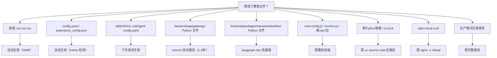

# DeerFlow 二次开发：代码修改生效机制说明

> 本文档聚焦“改动是否自动生效、是否需要重启、应重启哪个进程”。配套文档：`docs/modify-code-examples.md`。

## 一、系统架构总览

DeerFlow 由 4 个独立进程组成，通过 Nginx 反代统一对外：

```mermaid
graph TD
    "用户浏览器" --> "Nginx :2026"
    "Nginx :2026" --> "Frontend (Next.js) :3000"
    "Nginx :2026" --> "Gateway API (FastAPI/uvicorn) :8001"
    "Nginx :2026" --> "LangGraph Server :2024"
    "Gateway API :8001" -- "内部通信" --> "LangGraph Server :2024"
```

---

## 二、开发模式（`make dev`）下的自动热重载

> 仅 `make dev` 具备热重载能力；`make start`（生产模式）下改动默认需要重启。

### 2.1 前端（Next.js）- HMR 自动生效

命令：`pnpm run dev`（即 `next dev --turbo`）

自动热重载范围（浏览器自动刷新）：

| 文件/目录 | 说明 |
|---|---|
| `frontend/src/app/**/*.tsx` | 页面组件（如 `page.tsx`、`layout.tsx`） |
| `frontend/src/components/**` | UI 组件 |
| `frontend/src/core/**` | 核心逻辑（i18n、api、config、settings） |
| `frontend/src/hooks/**` | React Hooks |
| `frontend/src/styles/globals.css` | 全局样式 / Tailwind |

### 2.2 Gateway API（FastAPI/uvicorn）- `--reload` 自动重启

命令：`uvicorn ... --reload --reload-include='*.yaml' --reload-include='.env'`

自动重载范围（uvicorn 检测变化后约 1-3 秒重启）：

| 文件/目录 | 说明 |
|---|---|
| `backend/app/gateway/app.py` | FastAPI 应用入口 |
| `backend/app/gateway/routers/*.py` | API 路由 |
| `backend/app/gateway/config.py` | Gateway 配置 |
| `backend/app/channels/*.py` | IM 频道集成 |
| `config.yaml` | 应用配置（由 `--reload-include='*.yaml'` 覆盖） |
| `.env` | 环境变量（由 `--reload-include='.env'` 覆盖） |

### 2.3 LangGraph Server - `langgraph dev` 默认热重载

命令：`langgraph dev --no-browser --allow-blocking`（dev 模式不加 `--no-reload`）

自动热重载范围（监视 Python 文件变化）：

| 文件/目录 | 说明 |
|---|---|
| `backend/packages/harness/deerflow/agents/lead_agent/agent.py` | 主 Agent 逻辑 |
| `backend/packages/harness/deerflow/agents/lead_agent/prompt.py` | Prompt 模板 |
| `backend/packages/harness/deerflow/subagents/builtins/` | 内置子 Agent |
| `backend/packages/harness/deerflow/tools/` | 工具定义 |
| `backend/packages/harness/deerflow/models/` | 模型适配 |
| `backend/packages/harness/deerflow/agents/middlewares/` | 中间件 |

### 2.4 配置文件 - mtime 检测，无需重启

- `config.yaml`：`get_app_config()` 通过 mtime 判断并自动重载配置。
- `extensions_config.json`：MCP 缓存通过 `_is_cache_stale()` 自动失效并重建。
- `skills/*/SKILL.md`：技能加载逻辑按调用读取磁盘内容，修改后下次调用生效。
- Agent `SOUL.md` 与 `config.yaml`：构建 prompt 过程动态加载。

---

## 三、必须重启才能生效的情形

### 3.1 前端需要重启

| 场景 | 原因 |
|---|---|
| 修改 `frontend/next.config.js` | Next.js 应用级配置 |
| 修改 `frontend/src/env.js` | 环境变量 schema 构建期校验 |
| 新增或修改 `NEXT_PUBLIC_*` | 客户端环境变量编译期注入 |

### 3.2 添加前端依赖

操作步骤：

```bash
cd frontend
pnpm add <package-name>
# 然后重启前端服务
```

### 3.3 添加 Python 依赖

操作步骤：

```bash
cd backend
uv add <package-name>
# 然后重启后端服务
make stop && make dev
```

### 3.4 修改 Nginx 配置

操作步骤（修改 `docker/nginx/nginx.local.conf` 后）：

```bash
nginx -s reload -c $(pwd)/docker/nginx/nginx.local.conf -p $(pwd)
```

### 3.5 修改 Gateway 宿主配置（端口/CORS）

Gateway 端口和 CORS 在进程启动时从环境变量读取，需重启 Gateway 进程。

### 3.6 生产模式（`make start`）

生产模式禁用热重载，改动通常需要完整重启：

```bash
make stop && make start
```

---

## 四、完整速查表



---

## 五、操作命令速查

```bash
# 开发模式启动（推荐二次开发）
make dev

# 停止所有服务
make stop

# 仅重启后端 Gateway（不影响前端和 LangGraph）
pkill -f "uvicorn app.gateway.app:app"
cd backend && PYTHONPATH=. uv run uvicorn app.gateway.app:app --host 0.0.0.0 --port 8001 --reload &

# 仅重启 LangGraph Server
pkill -f "langgraph dev"
cd backend && uv run langgraph dev --no-browser --allow-blocking &

# 安装新 Python 包
cd backend && uv add <package>

# 安装新前端包
cd frontend && pnpm add <package>

# 重载 Nginx 配置（不中断连接）
nginx -s reload -c $(pwd)/docker/nginx/nginx.local.conf -p $(pwd)
```

---

## Notes

1. `config.yaml` 的 mtime 重载可在运行中生效，是配置层面的关键机制。
2. MCP 缓存具备自动失效，`extensions_config.json` 修改后下一次调用可生效。
3. Gateway 的 `--reload`（进程级重启）与 `get_app_config()` 的 mtime 检测（进程内重载）是两套机制。
4. 二次开发优先使用 `make dev`，集成测试再切换到 `make start`。
