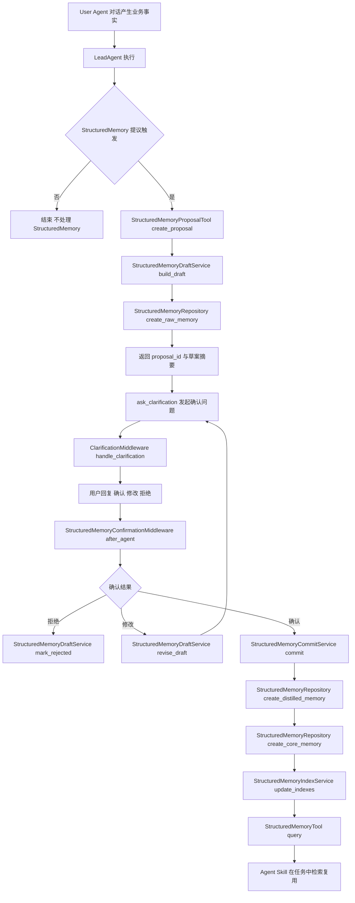

# StructuredMemory 通用记忆管理（并行双记忆）开发方案（MVP）

## 1. 目标与约束

### 1.1 目标

- 在现有项目上构建**StructuredMemory 通用记忆管理能力**，服务于 agent/skill 的知识沉淀与检索。
- StructuredMemory 覆盖：业务特征、变化历史、库表逻辑、规则约束、排障经验等，不局限于用户偏好。
- 与现有会话记忆并行共存，尽可能复用现有流程能力（中间件、队列、配置、工具注册、注入策略）。

### 1.2 关键约束

- StructuredMemory 不落 `memory.json`，采用 Chroma 持久化。
- 写入前需要 agent 与用户反复确认，不能在会话结束后自动写入。
- 方案基于当前仓库事实，优先最小化 MVP，后续可按效果重构。

### 1.3 当前代码基线（用于设计决策）

- 已有会话记忆主链路：`MemoryMiddleware.after_agent()` -> `MemoryUpdateQueue.add()` -> `MemoryUpdater.update_memory()` -> `MemoryStorage.save()`。
- `MemoryStorage` 当前抽象的数据契约是 `dict[str, Any]` 的单体 memory payload（对应 `memory.json`）。
- 已有 Chroma 分层仓储基础：`deerflow.memory.models`、`deerflow.memory.repository.StructuredMemoryRepository`，支持 `raw/distilled/core` 三层的 create/get。
- 尚无“确认后写入 StructuredMemory”的主流程编排（候选草案、确认状态机、提交动作）与统一查询接口。

---

## 2. 并行双记忆总体设计

### 2.1 两套记忆的职责拆分

- **会话记忆（现有）**
  - 目标：提升对当前用户协作习惯与近期上下文的连续性。
  - 特征：会话后异步自动提炼，注入系统提示词。
  - 存储：`MemoryStorage`（默认文件）。

- **StructuredMemory（新增）**
  - 目标：沉淀企业业务知识与结构化事实，服务跨会话、跨任务复用。
  - 特征：必须人工确认后入库，可追踪来源与变更。
  - 存储：`StructuredMemoryRepository`（Chroma）。

### 2.2 关于 `MemoryStorage` 是否可复用

- **可复用（建议复用）**
  - Provider 抽象思想（`MemoryStorage` + `get_memory_storage()` 的动态装配模式）。
  - 单例与线程锁初始化模式。
  - 基础配置加载方式（`memory_config` 风格）。

- **不建议直接复用为 StructuredMemory 主接口**
  - `MemoryStorage` 当前契约是“加载/保存整个 memory 字典”，与 StructuredMemory“多条记录、分层、可追溯来源、确认后写入”的语义不匹配。
  - StructuredMemory 需要 `create/query/list/link/update_status` 等面向记录的 API，不适合 `load/save(dict)`。

- **建议操作**
  - 保留 `MemoryStorage` 处理会话记忆。
  - 新增 `StructuredMemoryStore` 抽象（或 `StructuredMemoryRepository` 门面），底层首个实现接 `StructuredMemoryRepository`。
  - 两套记忆共用中间件装配、配置加载、工具调用入口和确认机制。

---

## 3. 新增后的记忆管理流程图（函数级）

---

## 4. 流程节点归属：原有 vs 新增 + MVP映射

| 流程节点 | 类型 | 说明 | 落地MVP |
|---|---|---|---|
| `LeadAgent` 执行主链路 | 原有 | 现有 agent 装配与运行 | 已有 |
| `ask_clarification` + `ClarificationMiddleware` | 原有 | 已有中断确认能力，可直接复用确认交互 | 已有 |
| `StructuredMemoryRepository.create_raw_memory()` | 原有（基础） | 已有 Chroma raw 层写入能力 | 已有 |
| `StructuredMemoryProposalTool.create_proposal()` | 新增 | 将候选结构化事实写为草案并发起确认 | MVP-1 |
| `StructuredMemoryDraftService.build_draft()` | 新增 | 统一草案生成、标签、来源、幂等键 | MVP-1 |
| `StructuredMemoryConfirmationMiddleware.after_agent()` | 新增 | 解析用户确认结果并驱动提交/修改/拒绝 | MVP-2 |
| `StructuredMemoryCommitService.commit()` | 新增 | 仅在确认后落库 distilled/core | MVP-2 |
| `StructuredMemoryRepository.create_distilled_memory()` | 原有（基础） | 已有能力，提交阶段复用 | MVP-2 |
| `StructuredMemoryRepository.create_core_memory()` | 原有（基础） | 已有能力，提交阶段复用 | MVP-2 |
| `StructuredMemoryTool.query()` | 新增 | 面向 agent/skill 的统一 StructuredMemory 检索入口 | MVP-3 |
| `StructuredMemoryIndexService.update_indexes()` | 新增 | 检索优化、标签索引、变更统计 | MVP-3/4 |
| `mark_rejected()/revise_draft()` | 新增 | 支持多轮确认与草案修订闭环 | MVP-2 |
| 记忆生命周期治理（归档/冲突合并） | 新增 | 后续增强，不放入最小闭环 | MVP-4 |

---

## 5. MVP 拆分与实施细节

## MVP-0（当前进度基线）

### 需实现/已有状态

- 已具备：
  - 会话记忆完整链路（自动提炼 + 注入）。
  - Chroma 分层 repository 基础数据结构与 create/get。
  - Clarification 中断能力可复用为确认交互。
- 未具备：
  - StructuredMemory 候选草案与确认状态机。
  - 确认后提交至 distilled/core 的编排服务。
  - 面向 agent/skill 的统一查询工具。

### 设计原因

- 先承认已有基础，再做最小补齐，避免推倒现有 memory 体系。

### 项目影响

- 仅形成基线，不改行为。

### upstream 合并冲突简案

- 当前阶段无新增代码冲突，只需持续关注 `agents/memory/*` 与 `memory/*` 目录上游变更。

### 当前进度

- 完成（基线确认）。

### 新增函数与配置清单（本阶段定义，不落代码）

- `StructuredMemoryRecordStatus`（枚举，新增）
  - 作用：统一草案和提交生命周期状态字典，避免后续多个模块用字符串常量分叉。
  - 设计理由：先定义跨模块契约，减少 MVP-1/2 重复返工。
- `StructuredMemorySourceRef`（结构体，新增）
  - 作用：统一 source 信息字段（thread/file/url/image/tool_call），供 raw/distilled/core 共用。
  - 设计理由：StructuredMemory 强调可追溯，先固定来源结构有利于查询和审计。
- `structured_memory.enabled`（配置，新增）
  - 作用：StructuredMemory 总开关，与现有 `memory.enabled` 解耦。
  - 设计理由：会话记忆与 StructuredMemory 要可独立启停，避免互相影响。
- `structured_memory.store`（配置，新增）
  - 作用：声明 StructuredMemory 后端类型，首版固定 `chroma`。
  - 设计理由：为后续引入 PGVector/ES 预留扩展点。

---

## MVP-1：StructuredMemory“候选草案”最小闭环（不入核心库）

### 需实现功能细节

- 新增 `StructuredMemoryProposalTool`：
  - 输入：`content/tags/raw_kind/source_ref/proposal_type`。
  - 输出：`proposal_id/status=draft/preview`。
- 新增 `StructuredMemoryDraftService`：
  - 负责规范化草案结构、幂等键、来源信息。
  - 调用 `create_raw_memory()` 存候选记录（raw 层）。
- 新增配置段（建议）：
  - `structured_memory.enabled`
  - `structured_memory.proposal.require_confirmation=true`
  - `structured_memory.store=chroma`
- 新增最小测试：
  - proposal tool/service 单测。
  - raw 草案写入成功与字段校验。

### 为什么这么设计

- 先把“可提议、可追踪”做出来，不直接入核心知识，风险最小。
- 复用现有 Chroma raw 层，降低首期研发量。

### 对当前项目影响

- 增加一个新工具和一个服务，不影响现有会话记忆自动更新链路。
- StructuredMemory 数据与 `memory.json` 完全隔离。

### upstream 合并冲突简案

- 新代码集中在 `deerflow/memory/` 与 `tools/builtins/` 新文件，减少改动热点。
- 如上游更新 `tools` 注册逻辑，优先保持新增工具在扩展注册点接入，避免改核心分发代码。

### 当前进度

- 未开始（建议优先实现）。

### 新增函数与配置清单（MVP-1 实现）

- `StructuredMemoryProposalTool.create_proposal(content, raw_kind, source_ref, tags, proposal_type)`（新增）
  - 作用：作为 agent/skill 统一入口，生成 StructuredMemory 草案并返回 `proposal_id`。
  - 设计理由：入口统一后，后续只需在 tool 层控制权限、参数校验与审计。
- `StructuredMemoryDraftService.build_draft(...)`（新增）
  - 作用：规范化草案（去噪、裁剪、标签标准化、字段补全）。
  - 设计理由：将“草案构建规则”从 tool 抽离，避免 prompt 和工具层重复实现。
- `StructuredMemoryDraftService.compute_idempotency_key(...)`（新增）
  - 作用：按 `content + source_ref + proposal_type` 生成幂等键，避免重复草案刷写。
  - 设计理由：企业场景同一事实反复提议概率高，幂等是最小成本降噪手段。
- `StructuredMemoryDraftService.save_raw_draft(...)`（新增）
  - 作用：调用 `StructuredMemoryRepository.create_raw_memory()` 写 raw 草案。
  - 设计理由：复用已有 repository，首期不改底层存储逻辑。
- `StructuredMemoryDraftService.get_draft(proposal_id)`（新增）
  - 作用：按提议 ID 取草案详情，用于确认前展示。
  - 设计理由：确认链路必须有稳定查询接口，不能依赖消息上下文临时拼装。
- `structured_memory.proposal.require_confirmation`（配置，新增）
  - 作用：强制确认开关，默认 `true`。
  - 设计理由：用配置固化“先确认再入库”规则，避免代码路径绕过。
- `structured_memory.proposal.max_content_length`（配置，新增）
  - 作用：限制单条草案长度，防止异常长文本污染记忆库。
  - 设计理由：保障存储与检索性能，便于后续分片策略演进。
- `structured_memory.proposal.allowed_raw_kinds`（配置，新增）
  - 作用：限制允许写入的 raw 来源类型集合。
  - 设计理由：先收敛来源范围，降低脏数据和越权写入风险。

---

## MVP-2：确认后提交闭环（核心业务需求）

### 需实现功能细节

- 新增 `StructuredMemoryConfirmationMiddleware`：
  - 监听包含 `proposal_id` 的确认回复。
  - 将用户回复映射为 `confirm/revise/reject`。
- 新增 `StructuredMemoryCommitService`：
  - `confirm`：raw -> distilled -> core（调用现有 repository create 接口）。
  - `revise`：更新草案内容，重新发起 `ask_clarification`。
  - `reject`：标记草案拒绝状态，不进入 distilled/core。
- 新增状态模型（建议）
  - `draft / pending_confirmation / confirmed / rejected / committed / revised`
  - 记录 `confirmed_by`、`confirmed_at`、`revision_count`。
- 新增测试
  - 中间件确认流转测试。
  - 多轮 revise 后再 confirm 测试。
  - reject 不落 core 的保护测试。

### 为什么这么设计

- 满足“不能会话结束后直接存储”的硬约束。
- 将“确认逻辑”与“提交逻辑”分离，便于后续复用到 skill 自动化场景。

### 对当前项目影响

- Agent 流程中新增 StructuredMemory 确认分支，但不改变原有会话记忆分支。
- 需要在提示词中补充“StructuredMemory 先提议后确认”的工具使用约束。

### upstream 合并冲突简案

- 中间件注入尽量通过 `custom_middlewares` 或独立工厂函数接入，减少直接修改 `make_lead_agent` 关键路径。
- 若上游调整 Clarification 机制，保持 `StructuredMemoryConfirmationMiddleware` 仅依赖标准 `ToolMessage`/state 字段，降低耦合。

### 当前进度

- 未开始（这是第一优先级功能）。

### 新增函数与配置清单（MVP-2 实现）

- `StructuredMemoryConfirmationMiddleware.after_agent(state, runtime)`（新增）
  - 作用：识别确认回复并驱动 `confirm/revise/reject` 状态流转。
  - 设计理由：复用现有 middleware 链，不侵入主 agent 节点实现。
- `StructuredMemoryConfirmationMiddleware._parse_confirmation_intent(message)`（新增）
  - 作用：把自然语言回复映射成确认意图与修订内容。
  - 设计理由：确认判定集中治理，便于后续加入更严格解析策略。
- `StructuredMemoryCommitService.commit(proposal_id, confirmer)`（新增）
  - 作用：将已确认草案提交到 distilled/core，并写提交审计字段。
  - 设计理由：把提交动作收敛到单一事务入口，降低跨层调用复杂度。
- `StructuredMemoryCommitService.revise(proposal_id, revision_note)`（新增）
  - 作用：更新草案文本与版本号，返回下一轮确认提示。
  - 设计理由：支持“反复确认”必须具备修订闭环，而不是确认失败即终止。
- `StructuredMemoryCommitService.reject(proposal_id, reason)`（新增）
  - 作用：标记拒绝并保留原因，用于后续分析错误提议模式。
  - 设计理由：拒绝记录是治理数据，不应直接删除。
- `StructuredMemoryCommitService.promote_to_distilled(raw_id, links)`（新增）
  - 作用：从 raw 提炼为 distilled，并建立来源引用关系。
  - 设计理由：显式分层可避免后续把业务事实直接混入 core。
- `StructuredMemoryCommitService.promote_to_core(distilled_ids)`（新增）
  - 作用：合并高价值 distilled 进入 core，形成可稳定复用的事实层。
  - 设计理由：core 应保持高质量、低噪声，必须通过确认后路径进入。
- `structured_memory.confirmation.max_rounds`（配置，新增）
  - 作用：限制最多修订轮次，防止无限循环确认。
  - 设计理由：保护交互体验和模型成本。
- `structured_memory.confirmation.timeout_minutes`（配置，新增）
  - 作用：草案待确认超时控制，过期转 `expired` 或 `rejected`。
  - 设计理由：企业场景里长时间未确认的草案通常价值衰减。
- `structured_memory.confirmation.require_proposal_id`（配置，新增）
  - 作用：确认回复必须携带 `proposal_id`，否则不提交。
  - 设计理由：避免多草案并行时的误提交。

---

## MVP-3：统一查询能力（agent/skill 可直接使用）

### 需实现功能细节

- 新增 `structured_memory_query` 工具（或 `StructuredMemoryTool.query`）：
  - 输入：`query_text/tier_filter/tags/user/agent/top_k/time_range`。
  - 输出：可解释结果（内容、置信度、来源链路、更新时间）。
- 新增 `StructuredMemorySearchService`：
  - 对接 Chroma query（向量或 metadata 过滤）。
  - 支持 tier 混合检索与 rerank（先简单打分）。
- 技能集成：
  - 在相关 skill 提示词中加入“先查 StructuredMemory 再执行”的策略。

### 为什么这么设计

- 没有查询就没有复用价值；先做最小查询工具让 agent/skill 真正消费 StructuredMemory。

### 对当前项目影响

- 增加工具组能力，可能影响模型工具选择概率，需要在 prompt 明确使用场景。

### upstream 合并冲突简案

- 工具定义走配置注册，避免硬编码在主工具列表。
- 若上游调整工具权限模型，按 group 维持隔离（如 `memory:business:read`）。

### 当前进度

- 未开始。

### 新增函数与配置清单（MVP-3 实现）

- `StructuredMemoryTool.query(query_text, tier_filter, tags, top_k, time_range)`（新增）
  - 作用：为 agent/skill 提供统一查询工具接口。
  - 设计理由：把复杂检索参数封装在工具层，降低 prompt 复杂度。
- `StructuredMemorySearchService.search(...)`（新增）
  - 作用：执行主检索流程（过滤 -> 召回 -> 排序 -> 裁剪）。
  - 设计理由：把 query 编排从 tool 中剥离，便于复用与测试。
- `StructuredMemorySearchService._build_where_filter(...)`（新增）
  - 作用：构建 metadata 过滤条件（tier/tags/user/agent/time）。
  - 设计理由：过滤逻辑集中后，避免不同调用方语义不一致。
- `StructuredMemorySearchService._rerank_results(...)`（新增）
  - 作用：综合向量分数、时间衰减、状态权重进行二次排序。
  - 设计理由：企业知识往往同时要求“相关性 + 时效性”。
- `StructuredMemorySearchService.format_for_agent(...)`（新增）
  - 作用：将检索结果格式化为 agent 可消费文本（含来源链路）。
  - 设计理由：统一输出样式，降低不同 skill 的接入成本。
- `structured_memory.query.default_top_k`（配置，新增）
  - 作用：设定默认召回条数。
  - 设计理由：保障稳定性能与可控 token 成本。
- `structured_memory.query.max_top_k`（配置，新增）
  - 作用：限制单次最大查询量。
  - 设计理由：避免大查询拖慢主链路。
- `structured_memory.query.default_tiers`（配置，新增）
  - 作用：设置默认检索层（如 `core + distilled`）。
  - 设计理由：默认避开 raw 噪声，提高首答质量。

---

## MVP-4：治理与演进（增强，不阻塞闭环）

### 需实现功能细节

- 冲突检测：相同主题多版本冲突标记。
- 生命周期治理：过期归档、软删除、重建索引。
- 可观测性：写入成功率、确认通过率、查询命中率。
- 可迁移性：抽象 `StructuredMemoryStore`，后续支持非 Chroma 后端。

### 为什么这么设计

- 企业场景里数据长期演进，治理能力决定可持续性。

### 对当前项目影响

- 运维与监控成本上升，但可显著提升长期稳定性与可审计性。

### upstream 合并冲突简案

- 将治理模块保持在 `deerflow/memory/structured_memory_*` 独立命名空间，减少与上游核心文件重叠。

### 当前进度

- 未开始。

### 新增函数与配置清单（MVP-4 实现）

- `StructuredMemoryGovernanceService.detect_conflicts(memory_ids)`（新增）
  - 作用：检测语义冲突或互斥事实并输出冲突组。
  - 设计理由：企业规则经常演进，冲突不可避免，需要自动预警。
- `StructuredMemoryGovernanceService.archive_expired(...)`（新增）
  - 作用：按 TTL 或状态将陈旧记录归档。
  - 设计理由：控制主库规模，提高查询质量。
- `StructuredMemoryGovernanceService.reindex(...)`（新增）
  - 作用：触发重建索引、修复 metadata 不一致。
  - 设计理由：长周期运行后必须有维护手段。
- `StructuredMemoryObservabilityService.emit_write_metrics(...)`（新增）
  - 作用：上报写入、确认、拒绝、查询命中指标。
  - 设计理由：没有指标就无法评估记忆系统价值。
- `StructuredMemoryStore`（抽象接口，新增）
  - 作用：抽象存储后端，定义 create/update/query/transaction 契约。
  - 设计理由：隔离 Chroma 细节，减少将来迁移代价。
- `structured_memory.governance.conflict_policy`（配置，新增）
  - 作用：冲突处理策略（保留新值/保留高置信/人工复核）。
  - 设计理由：不同业务线冲突策略不同，必须可配置。
- `structured_memory.governance.archive_ttl_days`（配置，新增）
  - 作用：归档时间窗口。
  - 设计理由：让治理策略参数化而非硬编码。
- `structured_memory.observability.enabled`（配置，新增）
  - 作用：治理指标开关。
  - 设计理由：在低成本环境可关闭，生产可开启。

---

## 6. 推荐代码落点（最小侵入）

- `backend/packages/harness/deerflow/memory/`
  - `structured_memory_models.py`（新增）
  - `structured_memory_repository.py`（新增，可封装现有 `StructuredMemoryRepository`）
  - `structured_memory_services.py`（新增：draft/commit/search）
- `backend/packages/harness/deerflow/tools/builtins/`
  - `structured_memory_tool.py`（新增）
- `backend/packages/harness/deerflow/agents/middlewares/`
  - `structured_memory_confirmation_middleware.py`（新增）
- `backend/packages/harness/deerflow/config/`
  - `structured_memory_config.py`（新增）
- `config.example.yaml`
  - 新增 `structured_memory` 配置段（新增）
- `backend/tests/`
  - `test_structured_memory_*.py`（新增）

---

## 7. 开发执行顺序（建议）

1. 先做 MVP-1（proposal + raw 草案）并补齐单测。
2. 再做 MVP-2（确认状态机 + commit 到 distilled/core）。
3. 再做 MVP-3（查询工具 + skill 接入）。
4. 最后做 MVP-4（治理、观测、迁移抽象）。

按这个顺序可保证每一步都可独立验收，且满足“先确认、再存储”的核心业务约束。
