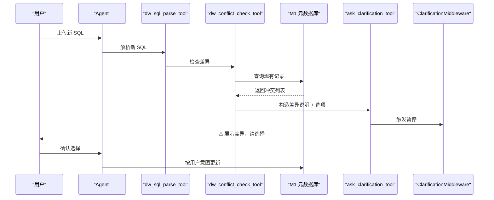
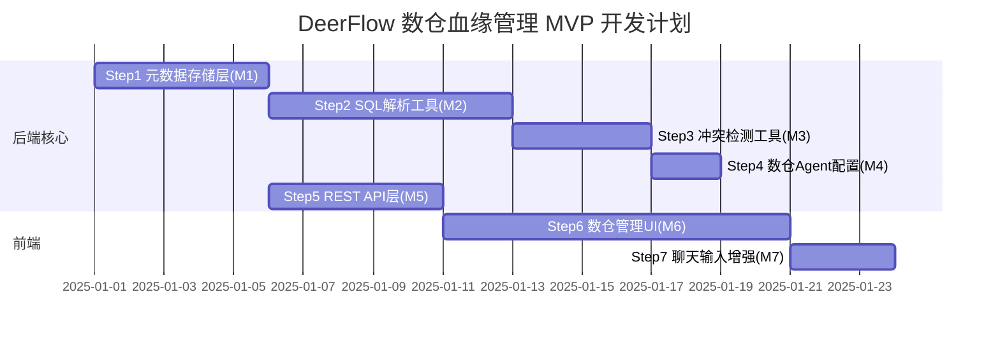

# 基于 DeerFlow 二次开发数仓血缘管理产品的 MVP 开发规划

## 一、DeerFlow 可复用的核心能力分析

在开始规划前，先明确 DeerFlow 已有哪些能力可以直接复用，避免重复造轮子：

**已有、直接复用：**
- **文件上传**：`backend/app/gateway/routers/uploads.py` 已完整实现 SQL 文件上传、存储、虚拟路径映射 [1](#0-0) 

- **用户澄清/确认机制**：`ClarificationMiddleware` + `ask_clarification_tool` 已实现完整的"智能体提问 → 暂停等待 → 用户回答 → 继续"交互流 [2](#0-1) [3](#0-2) 

- **结构化知识存储**：`MemoryUpdater` + JSON 文件存储模式（`memory.json`）可直接仿照扩展为数仓元数据存储 [4](#0-3) 

- **自定义 Agent**：`AgentConfig` + `SOUL.md` 机制可定义一个专属数仓分析 Agent [5](#0-4) 

- **工具注册体系**：`get_available_tools` 函数支持按 group 加载工具，可将新数仓工具注册为独立工具组 [6](#0-5) 

- **FastAPI Router 插件机制**：`create_app()` 中通过 `app.include_router()` 注册新路由，扩展无侵入 [7](#0-6) 

- **前端侧边栏导航扩展点**：`WorkspaceNavChatList` 已有 Chats / Agents 两项，模式固定，可直接添加 DW 入口 [8](#0-7) 

- **线程状态扩展**：`ThreadState` 已有 `uploaded_files` 字段，SQL 文件上传后可直接从 State 中获取 [9](#0-8) 

---

## 二、MVP 功能模块划分

```mermaid
graph TD
  "M1: 数仓元数据存储层" --> "M2: SQL 解析工具"
  "M1: 数仓元数据存储层" --> "M3: 冲突检测工具"
  "M2: SQL 解析工具" --> "M4: 数仓分析 Agent"
  "M3: 冲突检测工具" --> "M4: 数仓分析 Agent"
  "M4: 数仓分析 Agent" --> "M5: REST API 层"
  "M1: 数仓元数据存储层" --> "M5: REST API 层"
  "M5: REST API 层" --> "M6: 数仓管理前端 UI"
  "M4: 数仓分析 Agent" --> "M7: 聊天输入增强"
  "M6: 数仓管理前端 UI" --> "完整 MVP"
  "M7: 聊天输入增强" --> "完整 MVP"
```

| 模块 | 位置 | 说明 |
|---|---|---|
| M1 数仓元数据存储层 | 后端新增 | SQLite + Pydantic 模型，存储库、表、字段、血缘 |
| M2 SQL 解析工具 | 后端新增 LangChain Tool | 解析 SQL → 写入 M1 |
| M3 冲突检测工具 | 后端新增 LangChain Tool | 对比 M1 差异 → 触发 ask_clarification |
| M4 数仓分析 Agent | 后端配置 | 自定义 SOUL.md + 绑定 M2/M3 工具组 |
| M5 REST API 层 | 后端新增 FastAPI Router | 查询/管理元数据的 CRUD 接口 |
| M6 数仓管理前端 UI | 前端新增页面 | 表列表 + 血缘图 + 字段详情 |
| M7 聊天输入增强 | 前端改造 | SQL 上传入口 + 路径输入快捷方式 |

---

## 三、详细开发步骤（按依赖顺序）

### ✅ Step 1：数仓元数据存储层（M1）— 后端基础，最优先

**为什么先做**：其他所有模块（工具、API、前端）都依赖它，它是整个产品的数据底座。

**参照模式**：仿照 `memory.json` 的存储方式，但需要更结构化，推荐使用 SQLite（通过 SQLAlchemy）而非纯 JSON，以支持后续的差异查询。

**路径建议**：在 DeerFlow 现有的 `Paths` 类中扩展新的存储路径（如 `dw_catalog.db`） [10](#0-9) 

**需要新建的文件**：
```
backend/packages/harness/deerflow/dw_catalog/
├── __init__.py
├── models.py        # Pydantic + SQLAlchemy 模型：DWDatabase, DWTable, DWColumn, DWLineage
├── repository.py    # CRUD 操作封装
└── schema.py        # API 响应 schema
```

**核心数据模型**（设计要点）：
- `DWTable`：`db_name`, `table_name`, `description`, `source_sql`, `filter_logic`（WHERE 语句抽象）
- `DWColumn`：`table_id`, `col_name`, `col_type`, `description`, `source_expression`
- `DWLineage`：`upstream_table`, `downstream_table`, `join_condition`, `lineage_type`（direct/transform）

---

### ✅ Step 2：SQL 解析工具（M2）— 核心智能能力

**为什么第二做**：M1 完成后就可以写入数据，先实现最核心的 SQL 解析，可以尽早跑通端到端流程。

**参照模式**：仿照 `present_file_tool.py` 的工具声明方式，新建 `dw_sql_parse_tool` [11](#0-10) 

**推荐使用 `sqlglot` 库**（Python 纯解析，无依赖）：
- 支持 CREATE TABLE → 提取字段定义
- 支持 INSERT INTO ... SELECT / CREATE TABLE AS SELECT → 提取上下游血缘
- 支持 WITH CTE → 展开中间表逻辑
- 支持多方言：Hive, Spark SQL, BigQuery, MySQL

**工具功能**：
1. 接收 SQL 文本（直接输入 or 从 `uploaded_files` 路径读取 or 扫描目录下所有 `.sql` 文件）
2. 提取所有 DDL 和 DML 语句，结构化解析
3. 写入 M1 数仓元数据库
4. 返回解析摘要给 Agent

**需要新建的文件**：
```
backend/packages/harness/deerflow/dw_catalog/
└── sql_parser.py    # 基于 sqlglot 的解析逻辑

backend/packages/harness/deerflow/tools/dw/
├── __init__.py
└── dw_sql_parse_tool.py   # LangChain @tool 声明
```

**注册方式**：在 `config.yaml` 中增加工具组 `dw`，指向新工具，`get_available_tools` 会通过 `groups` 参数过滤加载 [12](#0-11) 

---

### ✅ Step 3：冲突检测工具（M3）— 核心交互能力

**为什么第三做**：M1 + M2 完成后，数据可以写入了，此时最重要的质量保障就是冲突检测。

**参照模式**：直接复用 `ask_clarification_tool` 的调用方式，冲突检测工具检测到差异后，内部调用 `ask_clarification` 来触发 `ClarificationMiddleware` 暂停流程等待用户

流程图：


**需要新建的文件**：
```
backend/packages/harness/deerflow/tools/dw/
└── dw_conflict_check_tool.py
```

---

### ✅ Step 4：数仓分析 Agent 配置（M4）

**为什么第四做**：工具都有了，把它们组装成一个专属 Agent，限定其行为和知识范围。

**参照模式**：使用已有的 `AgentConfig` + `SOUL.md` 机制，通过 API 创建或直接在文件系统创建 [13](#0-12) 

**配置内容**：
- `config.yaml`：指定 `tool_groups: ["dw"]`，限制该 Agent 只能使用数仓工具
- `SOUL.md`：注入数仓分析专家人设，例如：理解 DDL/DML 语义、血缘追踪原则、冲突处理流程说明 [5](#0-4) 

Agent 名称建议：`dw-analyst`，用户在聊天时选择此 Agent 即进入数仓分析模式。

---

### ✅ Step 5：数仓管理 REST API（M5）

**为什么第五做**：前端 UI 依赖这些 API，后端数据完备后可直接开发。

**参照模式**：仿照 `memory.py` 和 `agents.py` 的 Router 模式，新建 `dw_catalog.py` Router [14](#0-13) 

**需要新建**：`backend/app/gateway/routers/dw_catalog.py`

**API 端点设计**：
```
GET    /api/dw/tables                    # 获取所有库表列表（支持按 db 过滤）
GET    /api/dw/tables/{db}/{table}       # 获取单表详情（字段、筛选逻辑）
GET    /api/dw/lineage                   # 获取全量血缘图数据（节点+边）
GET    /api/dw/lineage/{db}/{table}      # 获取指定表的上下游血缘（可指定深度）
PUT    /api/dw/tables/{db}/{table}       # 手动修改表元数据
DELETE /api/dw/tables/{db}/{table}      # 删除表记录
GET    /api/dw/stats                     # 统计概览（表数、库数、血缘边数）
```

**注册到 app.py**： [15](#0-14) 

---

### ✅ Step 6：前端数仓管理 UI（M6）

**为什么第六做**：有了 API 后，前端是展示层，按照 Next.js App Router 模式添加新页面。

**参照模式**：在 `frontend/src/app/workspace/` 下新建 `dw/` 路由

**新增侧边栏导航入口**：修改 `WorkspaceNavChatList`，在 Chats / Agents 下方添加"数仓管理"图标和链接 [8](#0-7) 

**页面结构**：
```
frontend/src/app/workspace/dw/
├── layout.tsx               # 双栏布局：左侧表列表 + 右侧详情/图谱
├── page.tsx                 # 重定向到 /dw/overview
├── overview/
│   └── page.tsx             # 统计概览 + 全局血缘图
└── [db]/
    └── [table]/
        └── page.tsx         # 单表详情：字段列表 + 局部血缘图
```

**UI 组件设计（MVP 最小集）**：

1. **表列表组件** (`DWTableList`)
   - 按数据库分组树形展示
   - 搜索过滤
   - 点击跳转详情

2. **血缘图组件** (`DWLineageGraph`)
   - MVP 推荐使用 **`@xyflow/react`（React Flow）** 做力向图，已是 Next.js 生态主流
   - 节点：表（颜色区分 db），边：血缘方向带箭头
   - 点击节点 → 右侧展示表详情
   - 支持展开/收起上下游层级

3. **表详情面板** (`DWTableDetail`)
   - 基本信息：库名、表名、描述
   - 字段列表：字段名、类型、描述（可内联编辑）
   - 筛选逻辑：WHERE 条件的可读性展示
   - 直接血缘：上游/下游表列表（快速跳转）

**前端 API 调用层**：
仿照现有的 `api-client.ts` 模式，新建 `frontend/src/core/dw-catalog/api.ts` [16](#0-15) 

---

### ✅ Step 7：聊天输入增强（M7）— 完善用户体验

**为什么最后做**：这是锦上添花，基础流程跑通后再优化交互。

**改造点 1：SQL 文件上传入口**
现有 `InputBox` 已有 `AddAttachmentsButton`（回形针按钮），已支持上传文件，**无需改造**，直接复用 [17](#0-16) 

**改造点 2：路径输入快捷方式**
在输入框工具栏新增"扫描路径"按钮（`FolderSearchIcon`），点击展开路径输入框，用户输入路径后 Agent 自动构造扫描指令。

**改造点 3：聊天消息中展示解析预览**
解析完成后，Agent 调用 `present_file_tool` 输出 Markdown 格式的摘要，并在摘要中附带"查看血缘图"按钮跳转到 M6 对应表的页面 [18](#0-17) 

---

## 四、总体开发顺序与里程碑



| 阶段 | 步骤 | 核心交付物 | 可测试的里程碑 |
|---|---|---|---|
| 阶段一（后端数据层）| Step 1 | `dw_catalog` 存储模块 | 能用 Python 直接调用 CRUD |
| 阶段二（智能解析）| Step 2 + Step 3 + Step 4 | 3 个工具 + 1 个 Agent | 在聊天窗口粘贴 SQL，Agent 能自动解析并存储；冲突时弹出确认 |
| 阶段三（API 层）| Step 5 | `/api/dw/*` 接口 | curl 验证能查到解析结果 |
| 阶段四（前端）| Step 6 + Step 7 | 数仓管理页面 | 完整端到端：上传 SQL → 查血缘图 → 点击查字段 |

---

## 五、关键技术决策建议

| 决策点 | 推荐方案 | 理由 |
|---|---|---|
| 元数据存储 | SQLite + SQLAlchemy | 结构化查询方便做差异对比；仿照 DeerFlow paths.py 管理路径 |
| SQL 解析库 | `sqlglot` | 纯 Python、多方言、无需数据库连接、可 AST 级别访问 |
| 血缘图前端 | `@xyflow/react` (React Flow) | Next.js 生态最成熟的图渲染库，支持力向图+树形两种布局 |
| 冲突交互 | 直接复用 `ask_clarification_tool` + `ClarificationMiddleware` | **零改造**，完整流程已实现 |
| Agent 配置 | 自定义 SOUL.md + `tool_groups: ["dw"]` | 隔离工具权限，防止数仓 Agent 触发不相关工具 |
| 路径扫描 | Agent 通过 sandbox 文件系统访问，用 `thread_data.workspace_path` | 已有沙箱路径机制，Agent 天然可访问文件系统 |

---

## Notes

1. **SQL 文件上传已完全可用**：现有 `uploads.py` 的 `POST /api/threads/{thread_id}/uploads` 已支持上传任意文件并给 Agent 提供虚拟路径（`/mnt/user-data/uploads/xxx.sql`），无需改造，直接告知 Agent 从该路径读取 SQL 即可。 [19](#0-18) 

2. **冲突确认 0 改造**：`ask_clarification_tool` 的 `options` 参数可以传"保留现有逻辑"/"采用新逻辑"/"两者都保留"等选项，完全满足冲突确认场景，**不需要任何新代码**。 [20](#0-19) 

3. **工具组隔离**：将数仓工具注册为 `tool_groups: ["dw"]`，在 `dw-analyst` Agent 的 `config.yaml` 中指定 `tool_groups: ["dw"]`，这样数仓 Agent 不会触发搜索、代码执行等不相关工具，`get_available_tools` 的 `groups` 参数会自动过滤。 [12](#0-11) 

4. **AgentThreadState 可扩展**：如果需要在对话 State 中临时保存解析进度，可以扩展 `ThreadState`，仿照 `artifacts` 字段的方式添加自定义 reducer。 [9](#0-8) 

5. **MVP 范围建议**：血缘图在 MVP 阶段只做**直接上下游（一跳）**的力向图展示，多跳递归血缘追溯放到 V2，避免图渲染性能和数据完整性问题过早阻碍进度。

### Citations

**File:** backend/app/gateway/routers/uploads.py (L40-98)
```python
@router.post("", response_model=UploadResponse)
async def upload_files(
    thread_id: str,
    files: list[UploadFile] = File(...),
) -> UploadResponse:
    """Upload multiple files to a thread's uploads directory.

    For PDF, PPT, Excel, and Word files, they will be converted to markdown using markitdown.
    All files (original and converted) are saved to /mnt/user-data/uploads.

    Args:
        thread_id: The thread ID to upload files to.
        files: List of files to upload.

    Returns:
        Upload response with success status and file information.
    """
    if not files:
        raise HTTPException(status_code=400, detail="No files provided")

    uploads_dir = get_uploads_dir(thread_id)
    paths = get_paths()
    uploaded_files = []

    sandbox_provider = get_sandbox_provider()
    sandbox_id = sandbox_provider.acquire(thread_id)
    sandbox = sandbox_provider.get(sandbox_id)

    for file in files:
        if not file.filename:
            continue

        try:
            # Normalize filename to prevent path traversal
            safe_filename = Path(file.filename).name
            if not safe_filename or safe_filename in {".", ".."} or "/" in safe_filename or "\\" in safe_filename:
                logger.warning(f"Skipping file with unsafe filename: {file.filename!r}")
                continue

            content = await file.read()
            file_path = uploads_dir / safe_filename
            file_path.write_bytes(content)

            # Build relative path from backend root
            relative_path = str(paths.sandbox_uploads_dir(thread_id) / safe_filename)
            virtual_path = f"{VIRTUAL_PATH_PREFIX}/uploads/{safe_filename}"

            # Keep local sandbox source of truth in thread-scoped host storage.
            # For non-local sandboxes, also sync to virtual path for runtime visibility.
            if sandbox_id != "local":
                sandbox.update_file(virtual_path, content)

            file_info = {
                "filename": safe_filename,
                "size": str(len(content)),
                "path": relative_path,  # Actual filesystem path (relative to backend/)
                "virtual_path": virtual_path,  # Path for Agent in sandbox
                "artifact_url": f"/api/threads/{thread_id}/artifacts/mnt/user-data/uploads/{safe_filename}",  # HTTP URL
            }
```

**File:** backend/packages/harness/deerflow/tools/builtins/clarification_tool.py (L6-55)
```python
@tool("ask_clarification", parse_docstring=True, return_direct=True)
def ask_clarification_tool(
    question: str,
    clarification_type: Literal[
        "missing_info",
        "ambiguous_requirement",
        "approach_choice",
        "risk_confirmation",
        "suggestion",
    ],
    context: str | None = None,
    options: list[str] | None = None,
) -> str:
    """Ask the user for clarification when you need more information to proceed.

    Use this tool when you encounter situations where you cannot proceed without user input:

    - **Missing information**: Required details not provided (e.g., file paths, URLs, specific requirements)
    - **Ambiguous requirements**: Multiple valid interpretations exist
    - **Approach choices**: Several valid approaches exist and you need user preference
    - **Risky operations**: Destructive actions that need explicit confirmation (e.g., deleting files, modifying production)
    - **Suggestions**: You have a recommendation but want user approval before proceeding

    The execution will be interrupted and the question will be presented to the user.
    Wait for the user's response before continuing.

    When to use ask_clarification:
    - You need information that wasn't provided in the user's request
    - The requirement can be interpreted in multiple ways
    - Multiple valid implementation approaches exist
    - You're about to perform a potentially dangerous operation
    - You have a recommendation but need user approval

    Best practices:
    - Ask ONE clarification at a time for clarity
    - Be specific and clear in your question
    - Don't make assumptions when clarification is needed
    - For risky operations, ALWAYS ask for confirmation
    - After calling this tool, execution will be interrupted automatically

    Args:
        question: The clarification question to ask the user. Be specific and clear.
        clarification_type: The type of clarification needed (missing_info, ambiguous_requirement, approach_choice, risk_confirmation, suggestion).
        context: Optional context explaining why clarification is needed. Helps the user understand the situation.
        options: Optional list of choices (for approach_choice or suggestion types). Present clear options for the user to choose from.
    """
    # This is a placeholder implementation
    # The actual logic is handled by ClarificationMiddleware which intercepts this tool call
    # and interrupts execution to present the question to the user
    return "Clarification request processed by middleware"
```

**File:** backend/packages/harness/deerflow/agents/middlewares/clarification_middleware.py (L20-129)
```python
class ClarificationMiddleware(AgentMiddleware[ClarificationMiddlewareState]):
    """Intercepts clarification tool calls and interrupts execution to present questions to the user.

    When the model calls the `ask_clarification` tool, this middleware:
    1. Intercepts the tool call before execution
    2. Extracts the clarification question and metadata
    3. Formats a user-friendly message
    4. Returns a Command that interrupts execution and presents the question
    5. Waits for user response before continuing

    This replaces the tool-based approach where clarification continued the conversation flow.
    """

    state_schema = ClarificationMiddlewareState

    def _is_chinese(self, text: str) -> bool:
        """Check if text contains Chinese characters.

        Args:
            text: Text to check

        Returns:
            True if text contains Chinese characters
        """
        return any("\u4e00" <= char <= "\u9fff" for char in text)

    def _format_clarification_message(self, args: dict) -> str:
        """Format the clarification arguments into a user-friendly message.

        Args:
            args: The tool call arguments containing clarification details

        Returns:
            Formatted message string
        """
        question = args.get("question", "")
        clarification_type = args.get("clarification_type", "missing_info")
        context = args.get("context")
        options = args.get("options", [])

        # Type-specific icons
        type_icons = {
            "missing_info": "❓",
            "ambiguous_requirement": "🤔",
            "approach_choice": "🔀",
            "risk_confirmation": "⚠️",
            "suggestion": "💡",
        }

        icon = type_icons.get(clarification_type, "❓")

        # Build the message naturally
        message_parts = []

        # Add icon and question together for a more natural flow
        if context:
            # If there's context, present it first as background
            message_parts.append(f"{icon} {context}")
            message_parts.append(f"\n{question}")
        else:
            # Just the question with icon
            message_parts.append(f"{icon} {question}")

        # Add options in a cleaner format
        if options and len(options) > 0:
            message_parts.append("")  # blank line for spacing
            for i, option in enumerate(options, 1):
                message_parts.append(f"  {i}. {option}")

        return "\n".join(message_parts)

    def _handle_clarification(self, request: ToolCallRequest) -> Command:
        """Handle clarification request and return command to interrupt execution.

        Args:
            request: Tool call request

        Returns:
            Command that interrupts execution with the formatted clarification message
        """
        # Extract clarification arguments
        args = request.tool_call.get("args", {})
        question = args.get("question", "")

        print("[ClarificationMiddleware] Intercepted clarification request")
        print(f"[ClarificationMiddleware] Question: {question}")

        # Format the clarification message
        formatted_message = self._format_clarification_message(args)

        # Get the tool call ID
        tool_call_id = request.tool_call.get("id", "")

        # Create a ToolMessage with the formatted question
        # This will be added to the message history
        tool_message = ToolMessage(
            content=formatted_message,
            tool_call_id=tool_call_id,
            name="ask_clarification",
        )

        # Return a Command that:
        # 1. Adds the formatted tool message
        # 2. Interrupts execution by going to __end__
        # Note: We don't add an extra AIMessage here - the frontend will detect
        # and display ask_clarification tool messages directly
        return Command(
            update={"messages": [tool_message]},
            goto=END,
        )
```

**File:** backend/packages/harness/deerflow/agents/memory/updater.py (L40-57)
```python
def _create_empty_memory() -> dict[str, Any]:
    """Create an empty memory structure."""
    return {
        "version": "1.0",
        "lastUpdated": datetime.utcnow().isoformat() + "Z",
        "user": {
            "workContext": {"summary": "", "updatedAt": ""},
            "personalContext": {"summary": "", "updatedAt": ""},
            "topOfMind": {"summary": "", "updatedAt": ""},
        },
        "history": {
            "recentMonths": {"summary": "", "updatedAt": ""},
            "earlierContext": {"summary": "", "updatedAt": ""},
            "longTermBackground": {"summary": "", "updatedAt": ""},
        },
        "facts": [],
    }

```

**File:** backend/packages/harness/deerflow/config/agents_config.py (L18-25)
```python
class AgentConfig(BaseModel):
    """Configuration for a custom agent."""

    name: str
    description: str = ""
    model: str | None = None
    tool_groups: list[str] | None = None

```

**File:** backend/packages/harness/deerflow/tools/tools.py (L23-44)
```python
def get_available_tools(
    groups: list[str] | None = None,
    include_mcp: bool = True,
    model_name: str | None = None,
    subagent_enabled: bool = False,
) -> list[BaseTool]:
    """Get all available tools from config.

    Note: MCP tools should be initialized at application startup using
    `initialize_mcp_tools()` from deerflow.mcp module.

    Args:
        groups: Optional list of tool groups to filter by.
        include_mcp: Whether to include tools from MCP servers (default: True).
        model_name: Optional model name to determine if vision tools should be included.
        subagent_enabled: Whether to include subagent tools (task, task_status).

    Returns:
        List of available tools.
    """
    config = get_app_config()
    loaded_tools = [resolve_variable(tool.use, BaseTool) for tool in config.tools if groups is None or tool.group in groups]
```

**File:** backend/app/gateway/app.py (L72-188)
```python
def create_app() -> FastAPI:
    """Create and configure the FastAPI application.

    Returns:
        Configured FastAPI application instance.
    """

    app = FastAPI(
        title="DeerFlow API Gateway",
        description="""
## DeerFlow API Gateway

API Gateway for DeerFlow - A LangGraph-based AI agent backend with sandbox execution capabilities.

### Features

- **Models Management**: Query and retrieve available AI models
- **MCP Configuration**: Manage Model Context Protocol (MCP) server configurations
- **Memory Management**: Access and manage global memory data for personalized conversations
- **Skills Management**: Query and manage skills and their enabled status
- **Artifacts**: Access thread artifacts and generated files
- **Health Monitoring**: System health check endpoints

### Architecture

LangGraph requests are handled by nginx reverse proxy.
This gateway provides custom endpoints for models, MCP configuration, skills, and artifacts.
        """,
        version="0.1.0",
        lifespan=lifespan,
        docs_url="/docs",
        redoc_url="/redoc",
        openapi_url="/openapi.json",
        openapi_tags=[
            {
                "name": "models",
                "description": "Operations for querying available AI models and their configurations",
            },
            {
                "name": "mcp",
                "description": "Manage Model Context Protocol (MCP) server configurations",
            },
            {
                "name": "memory",
                "description": "Access and manage global memory data for personalized conversations",
            },
            {
                "name": "skills",
                "description": "Manage skills and their configurations",
            },
            {
                "name": "artifacts",
                "description": "Access and download thread artifacts and generated files",
            },
            {
                "name": "uploads",
                "description": "Upload and manage user files for threads",
            },
            {
                "name": "agents",
                "description": "Create and manage custom agents with per-agent config and prompts",
            },
            {
                "name": "suggestions",
                "description": "Generate follow-up question suggestions for conversations",
            },
            {
                "name": "channels",
                "description": "Manage IM channel integrations (Feishu, Slack, Telegram)",
            },
            {
                "name": "health",
                "description": "Health check and system status endpoints",
            },
        ],
    )

    # CORS is handled by nginx - no need for FastAPI middleware

    # Include routers
    # Models API is mounted at /api/models
    app.include_router(models.router)

    # MCP API is mounted at /api/mcp
    app.include_router(mcp.router)

    # Memory API is mounted at /api/memory
    app.include_router(memory.router)

    # Skills API is mounted at /api/skills
    app.include_router(skills.router)

    # Artifacts API is mounted at /api/threads/{thread_id}/artifacts
    app.include_router(artifacts.router)

    # Uploads API is mounted at /api/threads/{thread_id}/uploads
    app.include_router(uploads.router)

    # Agents API is mounted at /api/agents
    app.include_router(agents.router)

    # Suggestions API is mounted at /api/threads/{thread_id}/suggestions
    app.include_router(suggestions.router)

    # Channels API is mounted at /api/channels
    app.include_router(channels.router)

    @app.get("/health", tags=["health"])
    async def health_check() -> dict:
        """Health check endpoint.

        Returns:
            Service health status information.
        """
        return {"status": "healthy", "service": "deer-flow-gateway"}

    return app
```

**File:** frontend/src/components/workspace/workspace-nav-chat-list.tsx (L15-42)
```typescript
export function WorkspaceNavChatList() {
  const { t } = useI18n();
  const pathname = usePathname();
  return (
    <SidebarGroup className="pt-1">
      <SidebarMenu>
        <SidebarMenuItem>
          <SidebarMenuButton isActive={pathname === "/workspace/chats"} asChild>
            <Link className="text-muted-foreground" href="/workspace/chats">
              <MessagesSquare />
              <span>{t.sidebar.chats}</span>
            </Link>
          </SidebarMenuButton>
        </SidebarMenuItem>
        <SidebarMenuItem>
          <SidebarMenuButton
            isActive={pathname.startsWith("/workspace/agents")}
            asChild
          >
            <Link className="text-muted-foreground" href="/workspace/agents">
              <BotIcon />
              <span>{t.sidebar.agents}</span>
            </Link>
          </SidebarMenuButton>
        </SidebarMenuItem>
      </SidebarMenu>
    </SidebarGroup>
  );
```

**File:** backend/packages/harness/deerflow/agents/thread_state.py (L48-55)
```python
class ThreadState(AgentState):
    sandbox: NotRequired[SandboxState | None]
    thread_data: NotRequired[ThreadDataState | None]
    title: NotRequired[str | None]
    artifacts: Annotated[list[str], merge_artifacts]
    todos: NotRequired[list | None]
    uploaded_files: NotRequired[list[dict] | None]
    viewed_images: Annotated[dict[str, ViewedImageData], merge_viewed_images]  # image_path -> {base64, mime_type}
```

**File:** backend/packages/harness/deerflow/config/paths.py (L11-37)
```python
class Paths:
    """
    Centralized path configuration for DeerFlow application data.

    Directory layout (host side):
        {base_dir}/
        ├── memory.json
        ├── USER.md          <-- global user profile (injected into all agents)
        ├── agents/
        │   └── {agent_name}/
        │       ├── config.yaml
        │       ├── SOUL.md  <-- agent personality/identity (injected alongside lead prompt)
        │       └── memory.json
        └── threads/
            └── {thread_id}/
                └── user-data/         <-- mounted as /mnt/user-data/ inside sandbox
                    ├── workspace/     <-- /mnt/user-data/workspace/
                    ├── uploads/       <-- /mnt/user-data/uploads/
                    └── outputs/       <-- /mnt/user-data/outputs/

    BaseDir resolution (in priority order):
        1. Constructor argument `base_dir`
        2. DEER_FLOW_HOME environment variable
        3. Local dev fallback: cwd/.deer-flow  (when cwd is the backend/ dir)
        4. Default: $HOME/.deer-flow
    """

```

**File:** backend/packages/harness/deerflow/tools/builtins/__init__.py (L1-1)
```python
from .clarification_tool import ask_clarification_tool
```

**File:** backend/app/gateway/routers/agents.py (L165-224)
```python
@router.post(
    "/agents",
    response_model=AgentResponse,
    status_code=201,
    summary="Create Custom Agent",
    description="Create a new custom agent with its config and SOUL.md.",
)
async def create_agent_endpoint(request: AgentCreateRequest) -> AgentResponse:
    """Create a new custom agent.

    Args:
        request: The agent creation request.

    Returns:
        The created agent details.

    Raises:
        HTTPException: 409 if agent already exists, 422 if name is invalid.
    """
    _validate_agent_name(request.name)
    normalized_name = _normalize_agent_name(request.name)

    agent_dir = get_paths().agent_dir(normalized_name)

    if agent_dir.exists():
        raise HTTPException(status_code=409, detail=f"Agent '{normalized_name}' already exists")

    try:
        agent_dir.mkdir(parents=True, exist_ok=True)

        # Write config.yaml
        config_data: dict = {"name": normalized_name}
        if request.description:
            config_data["description"] = request.description
        if request.model is not None:
            config_data["model"] = request.model
        if request.tool_groups is not None:
            config_data["tool_groups"] = request.tool_groups

        config_file = agent_dir / "config.yaml"
        with open(config_file, "w", encoding="utf-8") as f:
            yaml.dump(config_data, f, default_flow_style=False, allow_unicode=True)

        # Write SOUL.md
        soul_file = agent_dir / "SOUL.md"
        soul_file.write_text(request.soul, encoding="utf-8")

        logger.info(f"Created agent '{normalized_name}' at {agent_dir}")

        agent_cfg = load_agent_config(normalized_name)
        return _agent_config_to_response(agent_cfg, include_soul=True)

    except HTTPException:
        raise
    except Exception as e:
        # Clean up on failure
        if agent_dir.exists():
            shutil.rmtree(agent_dir)
        logger.error(f"Failed to create agent '{request.name}': {e}", exc_info=True)
        raise HTTPException(status_code=500, detail=f"Failed to create agent: {str(e)}")
```

**File:** backend/app/gateway/routers/memory.py (L1-10)
```python
"""Memory API router for retrieving and managing global memory data."""

from fastapi import APIRouter
from pydantic import BaseModel, Field

from deerflow.agents.memory.updater import get_memory_data, reload_memory_data
from deerflow.config.memory_config import get_memory_config

router = APIRouter(prefix="/api", tags=["memory"])

```

**File:** frontend/src/core/api/api-client.ts (L1-31)
```typescript
"use client";

import { Client as LangGraphClient } from "@langchain/langgraph-sdk/client";

import { getLangGraphBaseURL } from "../config";

import { sanitizeRunStreamOptions } from "./stream-mode";

function createCompatibleClient(isMock?: boolean): LangGraphClient {
  const client = new LangGraphClient({
    apiUrl: getLangGraphBaseURL(isMock),
  });

  const originalRunStream = client.runs.stream.bind(client.runs);
  client.runs.stream = ((threadId, assistantId, payload) =>
    originalRunStream(
      threadId,
      assistantId,
      sanitizeRunStreamOptions(payload),
    )) as typeof client.runs.stream;

  const originalJoinStream = client.runs.joinStream.bind(client.runs);
  client.runs.joinStream = ((threadId, runId, options) =>
    originalJoinStream(
      threadId,
      runId,
      sanitizeRunStreamOptions(options),
    )) as typeof client.runs.joinStream;

  return client;
}
```

**File:** frontend/src/components/workspace/input-box.tsx (L889-902)
```typescript
function AddAttachmentsButton({ className }: { className?: string }) {
  const { t } = useI18n();
  const attachments = usePromptInputAttachments();
  return (
    <Tooltip content={t.inputBox.addAttachments}>
      <PromptInputButton
        className={cn("px-2!", className)}
        onClick={() => attachments.openFileDialog()}
      >
        <PaperclipIcon className="size-3" />
      </PromptInputButton>
    </Tooltip>
  );
}
```

**File:** backend/packages/harness/deerflow/tools/builtins/present_file_tool.py (L1-1)
```python
from pathlib import Path
```
